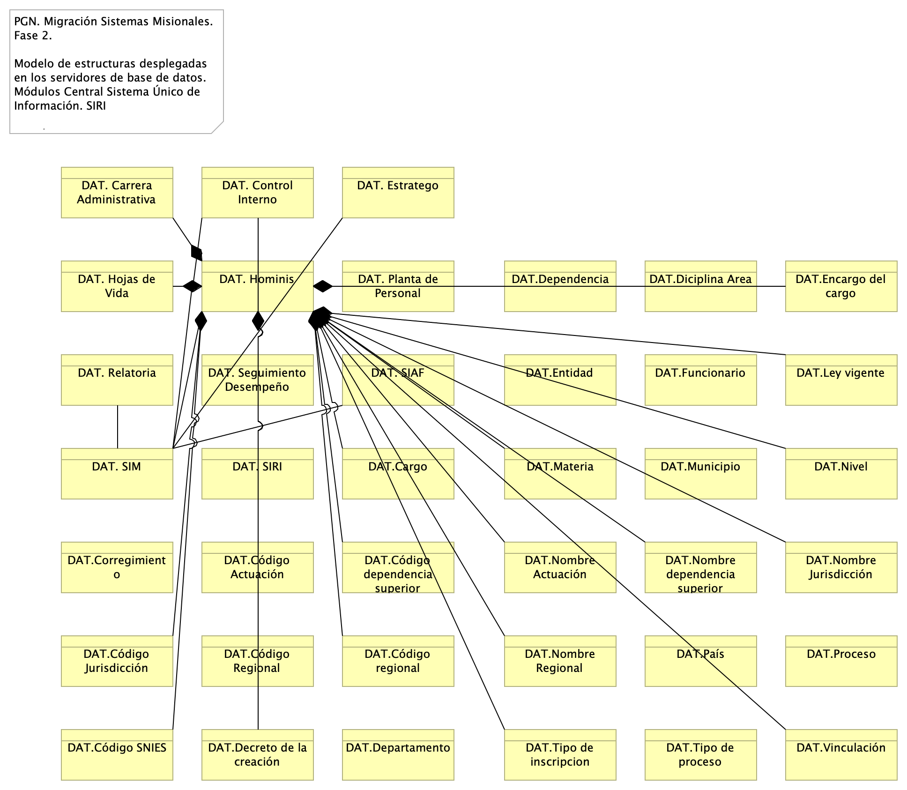
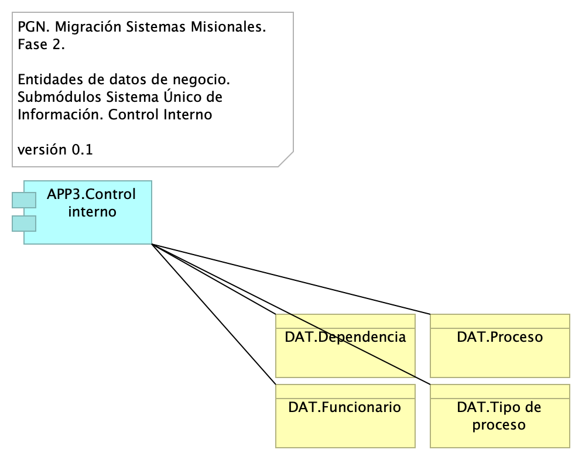
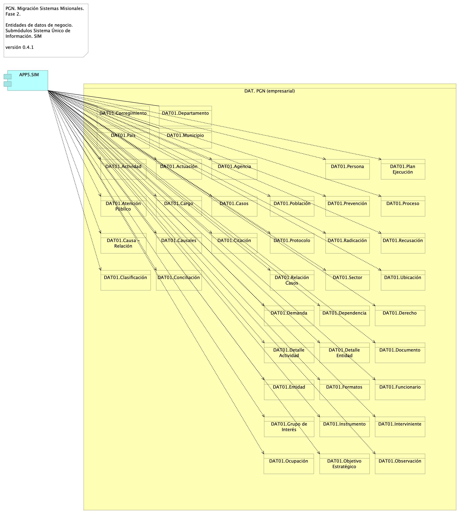
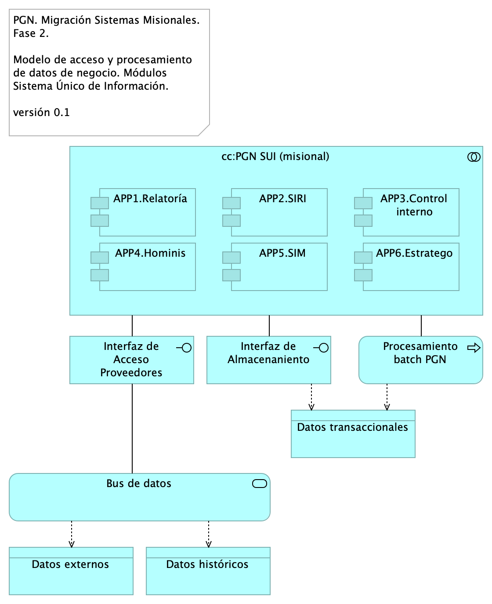

# Arquitectura de Información (Datos)
* [Diagrama Modelo de Datos Conceptual](#diagrama-modelo-de-datos-conceptual)
	* [Migracion.2a.a1.Datos Lógico](#migracion.2a.a1.datos-lógico)
* [Diagrama Modelo de Datos Físico (diagramas entidad-relación)](#diagrama-modelo-de-datos-físico-diagramas-entidad-relación)
	* [Migracion.2a.a3. Datos Modelo Físico ](#migracion.2a.a3.-datos-modelo-físico-)
* [Diagrama Modelo de Datos Lógico](#diagrama-modelo-de-datos-lógico)
	* [Migracion.2c. Datos Hominis](#migracion.2c.-datos-hominis)
	* [Migracion.2c3. Datos Control Interno](#migracion.2c3.-datos-control-interno)
	* [Migracion.2c2. Datos SIRI](#migracion.2c2.-datos-siri)
	* [Migracion.2c1. Datos SIM](#migracion.2c1.-datos-sim)
* [Documento Diccionarios de Datos](#documento-diccionarios-de-datos)
* [Mapa de Información (flujos de información)](#mapa-de-información-flujos-de-información)
	* [Migracion.2. datos](#migracion.2.-datos)
* [Modelo Ontológico](#modelo-ontológico)

\newpage

# Diagrama Modelo de Datos Conceptual
## Migracion.2a.a1.Datos Lógico
{#fig:Migracion.2a.a1.DatosLógico width=5.32in}

Organización de los grupos de datos (dominios) del SUI Migrado, 2023.

### Catálogo de Elementos
| Name| Type| Description| Properties
|:--------|:--------|:--------|:--------|
|**DAT. Control Interno**|business-object|||
|**DAT. Estratego**|business-object|Entidades de datos de negocio de capital humano de la PGN. Sistema de información Homini. ||
|**DAT. Hominis**|business-object|Entidades de datos de negocio de capital humano de la PGN. Sistema de información Homini. ||
|**DAT. SIAF**|business-object|Entidades de datos de negocio de capital humano de la PGN. Sistema de información Homini. ||
|**DAT. SIM**|business-object|||
|**DAT. SIRI**|business-object|||

\newpage

# Diagrama Modelo de Datos Físico (diagramas entidad-relación)
## Migracion.2a.a3. Datos Modelo Físico 
{#fig:Migracion.2a.a3.DatosModeloFísico width=}

En contrucción.

### Catálogo de Elementos
| Name| Type| Description| Properties
|:--------|:--------|:--------|:--------|

\newpage

# Diagrama Modelo de Datos Lógico
## Migracion.2c. Datos Hominis
{#fig:Migracion.2c.DatosHominis width=5.32in}

Identificación de entidades de datos de negocio relacionadas al módulo de gestión de capital del SUI, Hominis.

Estas entidades de datos de negocio son los que llamamos los tipos de datos internos del SUI y deben ser consideradas para la creación de las API de manejo del ciclo de vida de los datos de este módulo.

### Catálogo de Elementos
| Name| Type| Description| Properties
|:--------|:--------|:--------|:--------|
|**APP4.Hominis**|application-component|Módulo del SUI. Gestión de capital humano, funcionarios y cargos de representación y libre remoción de la PGN. ||
|**DAT. Hominis**|business-object|Entidades de datos de negocio de capital humano de la PGN. Sistema de información Homini. ||
|**DAT.Cargo**|business-object|||
|**DAT.Código Actuación**|business-object|||
|**DAT.Código Jurisdicción**|business-object|||
|**DAT.Código Regional**|business-object|||
|**DAT.Código SNIES**|business-object|||
|**DAT.Código dependencia superior**|business-object|||
|**DAT.Código regional**|business-object|||
|**DAT.Decreto de la creación**|business-object|||
|**DAT.Diciplina Area**|business-object|||
|**DAT.Encargo del cargo**|business-object|||
|**DAT.Ley vigente**|business-object|||
|**DAT.Materia**|business-object|||
|**DAT.Nivel**|business-object|||
|**DAT.Nombre Actuación**|business-object|||
|**DAT.Nombre Jurisdicción**|business-object|||
|**DAT.Nombre Regional**|business-object|||
|**DAT.Nombre dependencia superior**|business-object|||
|**DAT.Tipo de inscripcion**|business-object|||
|**DAT.Vinculación**|business-object|||

## Migracion.2c3. Datos Control Interno
{#fig:Migracion.2c3.DatosControlInterno width=}

Identificación de entidades de datos de negocio relacionadas al módulo de seguimiento del desempeño de la PGN del SUI, Control Interno.

Estas entidades de datos de negocio son los que llamamos los tipos de datos internos del SUI y deben ser consideradas para la creación de las API de manejo del ciclo de vida de los datos de este módulo. 

### Catálogo de Elementos
| Name| Type| Description| Properties
|:--------|:--------|:--------|:--------|
|**APP3.Control interno**|application-component|||
|**DAT.Dependencia**|business-object|||
|**DAT.Funcionario**|business-object|||
|**DAT.Proceso**|business-object|||
|**DAT.Tipo de proceso**|business-object|||

## Migracion.2c2. Datos SIRI
{#fig:Migracion.2c2.DatosSIRI width=}

Identificación de entidades de datos de negocio relacionadas al módulo del SUI, SIRI.

Estas entidades de datos de negocio son los que llamamos los tipos de datos internos del SUI y deben ser consideradas para la creación de las API de manejo del ciclo de vida de los datos de este módulo. 

### Catálogo de Elementos
| Name| Type| Description| Properties
|:--------|:--------|:--------|:--------|
|**APP2.SIRI**|application-component|||
|**DAT.Entidad**|business-object|||

## Migracion.2c1. Datos SIM
{#fig:Migracion.2c1.DatosSIM width=}

Identificación de entidades de datos de negocio relacionadas al módulo de SUI, SIM.

Estas entidades de datos de negocio son los que llamamos los tipos de datos internos del SUI y deben ser consideradas para la creación de las API de manejo del ciclo de vida de los datos de este módulo. 

### Catálogo de Elementos
| Name| Type| Description| Properties
|:--------|:--------|:--------|:--------|
|**APP5.SIM**|application-component|||
|**DAT.Corregimiento**|business-object|||
|**DAT.Departamento**|business-object|||
|**DAT.Municipio**|business-object|||
|**DAT.País**|business-object|||

\newpage

# Documento Diccionarios de Datos

\newpage

# Mapa de Información (flujos de información)
## Migracion.2. datos
{#fig:Migracion.2.datos width=5.32in}

Modelo de acceso y procesamiento a datos de negocio del SUI. Presentamos la organización de los ítems de datos de negocio necesarios para que los módulos del SUI puedan recolectar, procesar, integrar y almacenarlos de forma organizada y escalable.

Mediante esta organización, los datos de negocio son transportados desde sus respectivas fuentes mediante interfaces (por principio de extensión y mantenibilidad). Los datos externos, entendidos como los de otros proveedores, son obtenidos mediante un intermediario: el bus de datos del SUI.

Consideramos tres tipos datos: datos transaccionales, históricos y externos, y presentamos una manera distinta de tratarlos y transportarlos.

### Catálogo de Elementos
| Name| Type| Description| Properties
|:--------|:--------|:--------|:--------|
|**cc:PGN SUI (módulo central)**|application-collaboration|Módulo central SUI migrado. Módulo independiente y asignado a un dominio partigular de la PGN. ||
|**APP1.Relatoría**|application-component|Módulo del SUI. Relatoría pública. Publicación de información de referencia para funcionarios y personas naturales, cientes de la PGN.  ||
|**APP2.SIRI**|application-component|||
|**APP3.Control interno**|application-component|||
|**APP4.Hominis**|application-component|Módulo del SUI. Gestión de capital humano, funcionarios y cargos de representación y libre remoción de la PGN. ||
|**APP5.SIM**|application-component|||
|**APP6.Estratego**|application-component|||
|**Interfaz de Acceso Proveedores**|application-interface|Interfaz de acceso a los tipos de datos externos al SUI. ||
|**Interfaz de Almacenaniento**|application-interface|Interfaz de acceso a los repositorio, base de datos relacionales y no jerárquicas. Tipos de datos transaccionales, internos, del SUI. ||
|**Procesamiento batch PGN**|application-process|Los procesos de lotes, que requieren volumenes de datos altos, deben hacer parte de la arquitectura de datos del SUI. ||
|**Bus de datos**|application-service|El patrón de bus de datos tiene el rol de unir y referir a los datos externos al SUI de tal manera que hace transparente la localización y el formato de este tipo de datos. ||
|**Datos externos**|data-object|||
|**Datos históricos**|data-object|||
|**Datos transaccionales**|data-object|||

\newpage

# Modelo Ontológico

``Generated on: Thu Oct 19 2023 09:19:10 GMT-0500 (COT)``