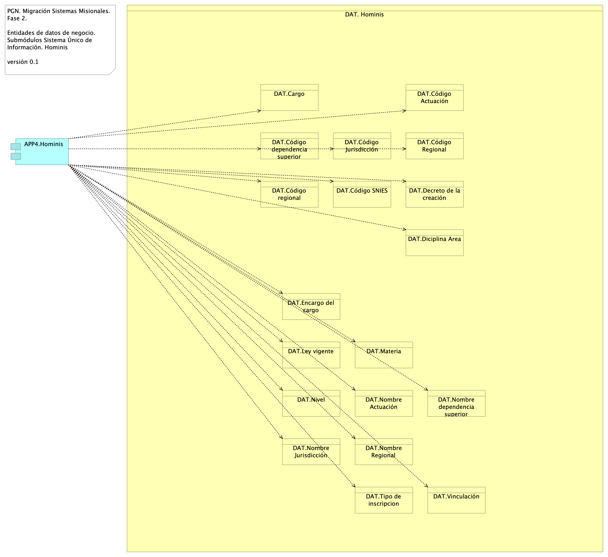

# Arquitectura de Información (Datos)
* [Diagrama Modelo de Datos Conceptual](#diagrama-modelo-de-datos-conceptual)
	* [Migracion.2a.a1.Datos Información](#migracion.2a.a1.datos-información)
* [Diagrama Modelo de Datos Físico (diagramas entidad-relación)](#diagrama-modelo-de-datos-físico-diagramas-entidad-relación)
	* [Migracion.2a.a3. Datos Modelo Físico ](#migracion.2a.a3.-datos-modelo-físico-)
* [Diagrama Modelo de Datos Lógico](#diagrama-modelo-de-datos-lógico)
	* [Migracion.2c1. Datos SIM](#migracion.2c1.-datos-sim)
	* [Migracion.2c. Datos Hominis](#migracion.2c.-datos-hominis)
	* [Migracion.2c3. Datos Control Interno](#migracion.2c3.-datos-control-interno)
	* [Migracion.2c2. Datos SIRI](#migracion.2c2.-datos-siri)
* [Documento Diccionarios de Datos](#documento-diccionarios-de-datos)
	* [Migracion.2a.a2. Datos Diccionario](#migracion.2a.a2.-datos-diccionario)
* [Mapa de Información (flujos de información)](#mapa-de-información-flujos-de-información)
	* [Migracion.2d2. Datos Organización](#migracion.2d2.-datos-organización)
	* [Migracion.2d3. Datos Transporte (flujo SUI - SIM)](#migracion.2d3.-datos-transporte-flujo-sui---sim)
	* [Migracion.2d4. Datos Transporte (flujo SUI - SUI)](#migracion.2d4.-datos-transporte-flujo-sui---sui)
* [Modelo Ontológico](#modelo-ontológico)
	* [Migracion.2a.a34 Datos Ontológico](#migracion.2a.a34-datos-ontológico)

\newpage

# Diagrama Modelo de Datos Conceptual
## Migracion.2a.a1.Datos Información
{#fig:Migracion.2a.a1.DatosInformación width=5.32in}

Modelo de información. Organización y jerarquía de los grupos de datos (dominios) del SUI Migrado, 2023. 

### Dominios Principales de Información SUI Migrado

* Dominio común: SIM
* Dominios individuales
	* Hominis: Planta de personal, Hojas de vida, Seguimiento de desempeño, Carrera administrativa
	* Conjunto de datos Relatoría
	* Control Interno
	* Conciliación Administrativa

 

### Catálogo de Elementos
| Nombre| Tipo| Descripción| Prop.
|:--------|:--------|:--------|:--------|
|**DAT. Conciliación Administrativa**|business-object|Entidades de datos de negocio de capital humano de la PGN. Sistema de información Homini. ||
|**DAT. Control Interno**|business-object|||
|**DAT. Estratego**|business-object|Entidades de datos de negocio de capital humano de la PGN. Sistema de información Homini. ||
|**DAT. Hominis**|business-object|Entidades de datos de negocio de capital humano de la PGN. Sistema de información Homini. ||
|**DAT. Hominis. Carrera Administrativa**|business-object|Entidades de datos de negocio de capital humano de la PGN. Sistema de información Homini. ||
|**DAT. Hominis. Hojas Vida**|business-object|Entidades de datos de negocio de capital humano de la PGN. Sistema de información Homini. ||
|**DAT. Hominis. Planta Personal**|business-object|Entidades de datos de negocio de capital humano de la PGN. Sistema de información Homini. ||
|**DAT. Hominis. Seguimiento Desempeño**|business-object|Entidades de datos de negocio de capital humano de la PGN. Sistema de información Homini. ||
|**DAT. Relatoría**|business-object|Entidades de datos de negocio de capital humano de la PGN. Sistema de información Homini. ||
|**DAT. SIAF**|business-object|Entidades de datos de negocio de capital humano de la PGN. Sistema de información Homini. ||
|**DAT. SIM: lappiz**|business-object|||
|**DAT. SIRI**|business-object|||

 

\newpage

# Diagrama Modelo de Datos Físico (diagramas entidad-relación)
## Migracion.2a.a3. Datos Modelo Físico 
{#fig:Migracion.2a.a3.DatosModeloFísico width=}

Los modelos físicos representados en diagramas entidad - relación (ER) de los módulos SUI Migrado, como Hominis, Control Interno, Relatoría, SIRI, serán entregados como documentos aparte, anexos al documento actual en formato reproducible.

El formato reproducible en el que entregamos el modelo físico mediante la herramienta libre Draw.io.

{#fig:Migracion.2a.a3.DatosModeloFísico width=}

### Catálogo de Elementos
| Nombre| Tipo| Descripción| Prop.
|:--------|:--------|:--------|:--------|

 

\newpage

# Diagrama Modelo de Datos Lógico
## Migracion.2c1. Datos SIM
{#fig:Migracion.2c1.DatosSIM width=}

Identificación de entidades de datos de negocio relacionadas al módulo de SUI, SIM.

Estas entidades de datos de negocio son los que llamamos los tipos de datos internos del SUI y deben ser consideradas para la creación de las API de manejo del ciclo de vida de los datos de este módulo. 

### Catálogo de Elementos
| Nombre| Tipo| Descripción| Prop.
|:--------|:--------|:--------|:--------|
|**APP5.SIM**|application-component|Módulo central SUI migrado. Módulo independiente y asignado a un dominio particular de la PGN: SIM. ||
|**DAT. SIM: lappiz**|business-object|||
|**DAT01.Actividad**|business-object|Actividad del SIM||
|**DAT01.Actuación**|business-object|Actuación del SIM||
|**DAT01.Agencia**|business-object|Agencia del SIM||
|**DAT01.Atención Público**|business-object|||
|**DAT01.Cargo**|business-object|Cargo del SIM||
|**DAT01.Casos**|business-object|Casos del SIM||
|**DAT01.Causa - Relación**|business-object|||
|**DAT01.Causales**|business-object|Causales del SIM||
|**DAT01.Citación**|business-object|Citación del SIM||
|**DAT01.Clasificación**|business-object|Clasificación del SIM||
|**DAT01.Conciliación**|business-object|Conciliación del SIM||
|**DAT01.Corregimiento**|business-object|||
|**DAT01.Demanda**|business-object|Demanda del SIM||
|**DAT01.Departamento**|business-object|Departamentos del SIM.||
|**DAT01.Dependencia**|business-object|Dependencia del SIM||
|**DAT01.Derecho**|business-object|Derecho del SIM||
|**DAT01.Detalle Actividad**|business-object|||
|**DAT01.Detalle Entidad**|business-object|||
|**DAT01.Documento**|business-object|Documento del SIM||
|**DAT01.Entidad**|business-object|Entidad del SIM||
|**DAT01.Formatos**|business-object|Formatos del SIM||
|**DAT01.Funcionario**|business-object|Funcionario del SIM||
|**DAT01.Grupo de Interés**|business-object|||
|**DAT01.Instrumento**|business-object|Instrumento del SIM||
|**DAT01.Interviniente**|business-object|Interviniente del SIM||
|**DAT01.Municipio**|business-object|Municipio del SIM||
|**DAT01.Objetivo Estratégico**|business-object|||
|**DAT01.Observación**|business-object|Observación del SIM||
|**DAT01.Ocupación**|business-object|Ocupación del SIM||
|**DAT01.País**|business-object|País del SIM||
|**DAT01.Persona**|business-object|Personas del SIM.||
|**DAT01.Plan Ejecución**|business-object|Plan Ejecución del SIM||
|**DAT01.Población**|business-object|Población del SIM||
|**DAT01.Prevención**|business-object|Prevención del SIM||
|**DAT01.Proceso**|business-object|Proceso del SIM||
|**DAT01.Protocolo**|business-object|Protocolo del SIM||
|**DAT01.Radicación**|business-object|Radicación del SIM||
|**DAT01.Recusación**|business-object|Recusación del SIM||
|**DAT01.Relación Casos**|business-object|Relación casos del SIM||
|**DAT01.Sector**|business-object|Sector del SIM||
|**DAT01.Ubicación**|business-object|Ubicación del SIM||

 

## Migracion.2c. Datos Hominis
{#fig:Migracion.2c.DatosHominis width=5.32in}

Identificación de entidades de datos de negocio relacionadas al módulo de gestión de capital del SUI, Hominis.

Estas entidades de datos de negocio son los que llamamos los tipos de datos internos del SUI y deben ser consideradas para la creación de las API de manejo del ciclo de vida de los datos de este módulo.

### Catálogo de Elementos
| Nombre| Tipo| Descripción| Prop.
|:--------|:--------|:--------|:--------|
|**APP4.Hominis**|application-component|Módulo del SUI. Gestión de capital humano, funcionarios y cargos de representación y libre remoción de la PGN. ||
|**DAT. Hominis**|business-object|Entidades de datos de negocio de capital humano de la PGN. Sistema de información Homini. ||
|**DAT.Cargo**|business-object|||
|**DAT.Código Actuación**|business-object|||
|**DAT.Código Jurisdicción**|business-object|||
|**DAT.Código Regional**|business-object|||
|**DAT.Código SNIES**|business-object|||
|**DAT.Código dependencia superior**|business-object|||
|**DAT.Código regional**|business-object|||
|**DAT.Decreto de la creación**|business-object|||
|**DAT.Diciplina Area**|business-object|||
|**DAT.Encargo del cargo**|business-object|||
|**DAT.Ley vigente**|business-object|||
|**DAT.Materia**|business-object|||
|**DAT.Nivel**|business-object|||
|**DAT.Nombre Actuación**|business-object|||
|**DAT.Nombre Jurisdicción**|business-object|||
|**DAT.Nombre Regional**|business-object|||
|**DAT.Nombre dependencia superior**|business-object|||
|**DAT.Tipo de inscripcion**|business-object|||
|**DAT.Vinculación**|business-object|||

 

## Migracion.2c3. Datos Control Interno
{#fig:Migracion.2c3.DatosControlInterno width=}

Identificación de entidades de datos de negocio relacionadas al módulo de seguimiento del desempeño de la PGN del SUI, Control Interno.

Estas entidades de datos de negocio son los que llamamos los tipos de datos internos del SUI y deben ser consideradas para la creación de las API de manejo del ciclo de vida de los datos de este módulo. 

### Catálogo de Elementos
| Nombre| Tipo| Descripción| Prop.
|:--------|:--------|:--------|:--------|
|**APP3.Control interno**|application-component|Módulo central SUI migrado. Módulo independiente y asignado a un dominio particular de la PGN: Control Interno. ||
|**DAT.Dependencia**|business-object|||
|**DAT.Funcionario**|business-object|||
|**DAT.Proceso**|business-object|||
|**DAT.Tipo de proceso**|business-object|||

 

## Migracion.2c2. Datos SIRI
{#fig:Migracion.2c2.DatosSIRI width=}

Identificación de entidades de datos de negocio relacionadas al módulo del SUI, SIRI.

Estas entidades de datos de negocio son los que llamamos los tipos de datos internos del SUI y deben ser consideradas para la creación de las API de manejo del ciclo de vida de los datos de este módulo. 

### Catálogo de Elementos
| Nombre| Tipo| Descripción| Prop.
|:--------|:--------|:--------|:--------|
|**APP2.SIRI**|application-component|Módulo central SUI migrado. Módulo independiente y asignado a un dominio particular de la PGN: SIRI. ||
|**DAT.Entidad**|business-object|||

 

\newpage

# Documento Diccionarios de Datos
## Migracion.2a.a2. Datos Diccionario
{#fig:Migracion.2a.a2.DatosDiccionario width=5.32in}

Los diccionarios de datos explicativos de los modelos de datos físicos de los módulos del SUI Migrado, representados en tablas campo-descripción, serán entregados como documentos anexos aparte del documento de arquitectura de datos actual, y en formato reproducible.

El formato reproducible en el que entregamos los diccionarios de datos del modelo físico es DOCX.

{#fig:Migracion.2a.a3.DatosModeloFísico width=}

### Catálogo de Elementos
| Nombre| Tipo| Descripción| Prop.
|:--------|:--------|:--------|:--------|

 

\newpage

# Mapa de Información (flujos de información)
## Migracion.2d2. Datos Organización
{#fig:Migracion.2d2.DatosOrganización width=5.32in}

Modelo de acceso y procesamiento a datos de negocio del SUI. La imagen siguiente presenta la organización de los ítems de transporte de datos de negocio necesarios para que los módulos del SUI puedan recolectar, procesar, integrar y almacenarlo de forma organizada y escalable.

Mediante esta organización, los datos de negocio son transportados desde sus respectivas fuentes mediante interfaces (principio de extensión y mantenibilidad referidos en las restricciones de la arquitecura del SUI Migrado). Los datos externos, entendidos como los de otros proveedores, son obtenidos mediante un intermediario: una API externa (_reverse proxy_).

Consideramos tres tipos datos: datos transaccionales, históricos y externos, y presentamos una manera distinta de tratarlos y transportarlos.

### Catálogo de Elementos
| Nombre| Tipo| Descripción| Prop.
|:--------|:--------|:--------|:--------|
|**cc:PGN SUI (módulo central)**|application-collaboration|Módulo central SUI migrado. Módulo independiente y asignado a un dominio particular de la PGN. ||
|**cc:PGN SUI (módulo central) 2**|application-collaboration|Módulo central SUI migrado. Módulo independiente y asignado a un dominio particular de la PGN. ||
|**APP1.Relatoría**|application-component|Módulo del SUI. Relatoría pública. Publicación de información de referencia para funcionarios y personas naturales, cientes de la PGN.  ||
|**APP2.SIRI**|application-component|Módulo central SUI migrado. Módulo independiente y asignado a un dominio particular de la PGN: SIRI. ||
|**APP3.Control interno**|application-component|Módulo central SUI migrado. Módulo independiente y asignado a un dominio particular de la PGN: Control Interno. ||
|**APP4.Hominis**|application-component|Módulo del SUI. Gestión de capital humano, funcionarios y cargos de representación y libre remoción de la PGN. ||
|**APP6.Estratego**|application-component|Módulo central SUI migrado. Módulo independiente y asignado a un dominio particular de la PGN: Estratego. ||
|**Interacción SUI - SIM**|application-interaction|Interacción de API SUI con API SIM para el transporte de entidades de negocio. Los tipos de datos que utilizan esta interacción entre aplicaciones son los datos externos al módulo central SUI que los requiera, los datos históricos que están por fuera del móduo SUI migrado, y los datos transaccionales de otros módulos SUI migrados. ||
|**Interfaz de Acceso Proveedores**|application-interface|Interfaz de acceso a los tipos de datos externos al SUI. El patrón de API Externa (reverse proxie) tiene el rol de unir y referir a los datos externos e históricos al SIU Migrado de tal manera que hace transparente la localización y el formato de este tipo de datos. ||
|**Interfaz de Almacenaniento**|application-interface|Interfaz de acceso a los repositorio, base de datos relacionales y no jerárquicas. Tipos de datos transaccionales, internos, del SUI. ||
|**Procesamiento de lotes PGN**|application-process|Los procesos de lotes, que requieren volumenes de datos altos, deben hacer parte de la arquitectura de datos del SUI. ||
|**API Externa (flujo de datos)**|application-service|El patrón de API Externa (reverse proxie) tiene el rol de unir y referir a los datos externos e históricos al SIU Migrado de tal manera que hace transparente la localización y el formato de este tipo de datos. ||
|**Datos externos**|data-object|||
|**Datos históricos**|data-object|||
|**Datos transaccionales SUI**|data-object|||
|**Datos transaccionales módulo SUI**|data-object|Registros de trabajo de un módulo SUI Migrado, 2023. ||

 

## Migracion.2d3. Datos Transporte (flujo SUI - SIM)
.png){#fig:Migracion.2d3.DatosTransporte(flujoSUI-SIM) width=5.32in}

Modelo de acceso a datos de negocio del SIM. 

La imagen siguiente presenta la organización de los ítems de transporte de datos de negocio necesarios para que los módulos del SUI puedan recolectar, procesar, integrar y almacenarlo de forma organizada y escalable.

Mediante esta organización, los datos de negocio son transportados desde sus respectivas fuentes mediante interfaces (principio de extensión y mantenibilidad referidos en las restricciones de la arquitecura del SUI Migrado). Los datos externos, entendidos como los de otros proveedores, son obtenidos mediante un intermediario: una API externa (_reverse proxy_).

Consideramos tres tipos datos: datos transaccionales, históricos y externos, y presentamos una manera distinta de tratarlos y transportarlos.

### Catálogo de Elementos
| Nombre| Tipo| Descripción| Prop.
|:--------|:--------|:--------|:--------|
|**cc:PGN SUI (módulo central)**|application-collaboration|Módulo central SUI migrado. Módulo independiente y asignado a un dominio particular de la PGN. ||
|**APP5.SIM**|application-component|Módulo central SUI migrado. Módulo independiente y asignado a un dominio particular de la PGN: SIM. ||
|**Interacción SUI - SIM**|application-interaction|Interacción de API SUI con API SIM para el transporte de entidades de negocio. Los tipos de datos que utilizan esta interacción entre aplicaciones son los datos externos al módulo central SUI que los requiera, los datos históricos que están por fuera del móduo SUI migrado, y los datos transaccionales de otros módulos SUI migrados. ||
|**Interfaz de Acceso Proveedores**|application-interface|Interfaz de acceso a los tipos de datos externos al SUI. El patrón de API Externa (reverse proxie) tiene el rol de unir y referir a los datos externos e históricos al SIU Migrado de tal manera que hace transparente la localización y el formato de este tipo de datos. ||
|**Interfaz de Almacenaniento**|application-interface|Interfaz de acceso a los repositorio, base de datos relacionales y no jerárquicas. Tipos de datos transaccionales, internos, del SUI. ||
|**Datos externos**|data-object|||
|**Datos históricos**|data-object|||
|**Datos transaccionales módulo SUI**|data-object|Registros de trabajo de un módulo SUI Migrado, 2023. ||

 

## Migracion.2d4. Datos Transporte (flujo SUI - SUI)
.png){#fig:Migracion.2d4.DatosTransporte(flujoSUI-SUI) width=5.32in}

Modelo de acceso y procesamiento a datos de negocio del SUI. La imagen siguiente presenta la organización de los ítems de transporte de datos de negocio necesarios para que los módulos del SUI puedan recolectar, procesar, integrar y almacenarlo de forma organizada y escalable.

Mediante esta organización, los datos de negocio son transportados desde sus respectivas fuentes mediante interfaces (principio de extensión y mantenibilidad referidos en las restricciones de la arquitecura del SUI Migrado). Los datos externos, entendidos como los de otros proveedores, son obtenidos mediante un intermediario: una API externa (_reverse proxy_).

Consideramos tres tipos datos: datos transaccionales, históricos y externos, y presentamos una manera distinta de tratarlos y transportarlos.

### Catálogo de Elementos
| Nombre| Tipo| Descripción| Prop.
|:--------|:--------|:--------|:--------|
|**cc:PGN SUI (módulo central)**|application-collaboration|Módulo central SUI migrado. Módulo independiente y asignado a un dominio particular de la PGN. ||
|**cc:PGN SUI (módulo central) 2**|application-collaboration|Módulo central SUI migrado. Módulo independiente y asignado a un dominio particular de la PGN. ||
|**Interfaz de Acceso Proveedores**|application-interface|Interfaz de acceso a los tipos de datos externos al SUI. El patrón de API Externa (reverse proxie) tiene el rol de unir y referir a los datos externos e históricos al SIU Migrado de tal manera que hace transparente la localización y el formato de este tipo de datos. ||
|**Interfaz de Acceso Proveedores 2**|application-interface|Interfaz de acceso a los tipos de datos externos al SUI. El patrón de API Externa (reverse proxie) tiene el rol de unir y referir a los datos externos e históricos al SIU Migrado de tal manera que hace transparente la localización y el formato de este tipo de datos. ||
|**Interfaz de Almacenaniento**|application-interface|Interfaz de acceso a los repositorio, base de datos relacionales y no jerárquicas. Tipos de datos transaccionales, internos, del SUI. ||
|**Datos transaccionales SUI**|data-object|||
|**Datos transaccionales módulo SUI**|data-object|Registros de trabajo de un módulo SUI Migrado, 2023. ||

 

\newpage

# Modelo Ontológico
## Migracion.2a.a34 Datos Ontológico
{#fig:Migracion.2a.a34DatosOntológico width=5.32in}

En construcción.

### Catálogo de Elementos
| Nombre| Tipo| Descripción| Prop.
|:--------|:--------|:--------|:--------|

 

``Generated on: Tue Nov 28 2023 09:30:23 GMT-0500 (COT)``