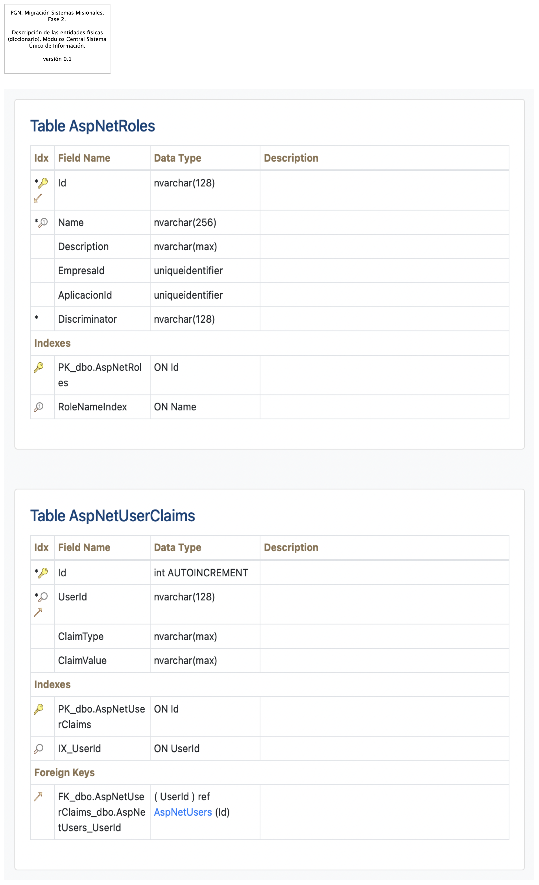

# Arquitectura de Información (Datos)
* [Diagrama Modelo de Datos Conceptual](#diagrama-modelo-de-datos-conceptual)
	* [Migracion.2a.a1.Datos Información](#migracion.2a.a1.datos-información)
* [Diagrama Modelo de Datos Físico (diagramas entidad-relación)](#diagrama-modelo-de-datos-físico-diagramas-entidad-relación)
	* [Migracion.2a.a3. Datos Modelo Físico ](#migracion.2a.a3.-datos-modelo-físico-)
	* [Migracion.2a.a3. Datos Modelo Físico. Dominios](#migracion.2a.a3.-datos-modelo-físico.-dominios)
* [Diagrama Modelo de Datos Lógico](#diagrama-modelo-de-datos-lógico)
	* [Migracion.2c1. Datos SIM](#migracion.2c1.-datos-sim)
	* [Migracion.2c. Datos Hominis](#migracion.2c.-datos-hominis)
	* [Migracion.2c3. Datos Control Interno](#migracion.2c3.-datos-control-interno)
	* [Migracion.2c2. Datos SIRI](#migracion.2c2.-datos-siri)
* [Documento Diccionarios de Datos](#documento-diccionarios-de-datos)
	* [Migracion.2a.a2. Datos Diccionario](#migracion.2a.a2.-datos-diccionario)
* [Mapa de Información (flujos de información)](#mapa-de-información-flujos-de-información)
	* [Migracion.2d2. Datos Organización](#migracion.2d2.-datos-organización)
	* [Migracion.2d3. Datos Transporte (flujo SUI - SIM)](#migracion.2d3.-datos-transporte-flujo-sui---sim)
	* [Migracion.2d4. Datos Transporte (flujo SUI - SUI)](#migracion.2d4.-datos-transporte-flujo-sui---sui)
* [Modelo Ontológico](#modelo-ontológico)
	* [Migracion.2a.a34 Datos Ontológico](#migracion.2a.a34-datos-ontológico)

\newpage

# Diagrama Modelo de Datos Conceptual
## Migracion.2a.a1.Datos Información
{#fig:Migracion.2a.a1.DatosInformación width=5.32in}

Modelo de información del $APLICATIVO. Organización y jerarquía de los grupos de datos, llamados dominios de información, del SUI Migrado, 2023. 

La jerarquía de los dominios de información, empresarial (mayor jerarquía), misional y de negocio (tercer nivel de jerarquía) permite establecer las reglas de acceso, el tipo de almacenamiento físico, y las estrategias de distribución de estos dominios, acorde al gobierno de datos que PGN realice.

### Dominios Principales de Información SUI Migrado

* Dominio común: PGN
* Dominio de información SIM
* Dominios individuales
	* Hominis: Planta de personal, Hojas de vida, Seguimiento de desempeño, Carrera administrativa
	* Conjunto de datos Relatoría
	* Control Interno
	* Conciliación Administrativa

 

### Dominio de Información  Común SUI PGN
Los conceptos de negocio dentro de este dominio compartido por todas los sistemas de información de PGN son:

* Dependencias
* Entidades
* Funcionarios 
* País
* Departamento
* Municipio
* Corregimiento
* Tipo identificación
* Personas
* Regionales
* Cargos
* Nivel del cargo
* Novedad de nombramiento
* Profesión

 

### Catálogo de Elementos
| Nombre| Tipo| Descripción| Prop.
|:--------|:--------|:--------|:--------|
|**DAT. Conciliación Administrativa**|business-object|Entidades de datos de negocio de capital humano de la PGN. Sistema de información Homini. |*dominio:* lógico |
|**DAT. Control Interno**|business-object||*dominio:* lógico |
|**DAT. Estratego**|business-object|Entidades de datos de negocio de capital humano de la PGN. Sistema de información Homini. |*dominio:* lógico |
|**DAT. Hominis**|business-object|Entidades de datos de negocio de capital humano de la PGN. Sistema de información Homini. |*dominio:* lógico |
|**DAT. Hominis. Carrera Administrativa**|business-object|Entidades de datos de negocio de capital humano de la PGN. Sistema de información Homini. |*dominio:* lógico |
|**DAT. Hominis. Hojas Vida**|business-object|Entidades de datos de negocio de capital humano de la PGN. Sistema de información Homini. |*dominio:* lógico |
|**DAT. Hominis. Planta Personal**|business-object|Entidades de datos de negocio de capital humano de la PGN. Sistema de información Homini. |*dominio:* lógico |
|**DAT. Hominis. Seguimiento Desempeño**|business-object|Entidades de datos de negocio de capital humano de la PGN. Sistema de información Homini. |*dominio:* lógico |
|**DAT. PGN (empresarial)**|business-object|Dominio de datos comunes a todas las aplicaciones de PGN.  |*dominio:* lógico |
|**DAT. Relatoría**|business-object|Entidades de datos de negocio de capital humano de la PGN. Sistema de información Homini. |*dominio:* lógico |
|**DAT. SIAF**|business-object|Entidades de datos de negocio de capital humano de la PGN. Sistema de información Homini. |*dominio:* lógico |
|**DAT. SIM**|business-object|Dominio de datos particular al sistema de informació SIM de PGN. |*dominio:* lógico |
|**DAT. SIRI**|business-object||*dominio:* lógico |
|**Información Empresarial**|grouping|||
|**Información Misional y Operativa (gral.)**|grouping|||
|**Información de Negocio (particular)**|grouping|||

 

\newpage

# Diagrama Modelo de Datos Físico (diagramas entidad-relación)
## Migracion.2a.a3. Datos Modelo Físico 
{#fig:Migracion.2a.a3.DatosModeloFísico width=}

Los modelos físicos representados en diagramas entidad - relación (ER) de los módulos $APLICATIVO, como Hominis, Control Interno, Relatoría, SIRI, serán entregados como documentos aparte, anexos al documento actual en formato reproducible.

El formato reproducible en el que entregamos el modelo físico mediante la herramienta libre Draw.io.

### Catálogo de Elementos
| Nombre| Tipo| Descripción| Prop.
|:--------|:--------|:--------|:--------|

 

## Migracion.2a.a3. Datos Modelo Físico. Dominios
{#fig:Migracion.2a.a3.DatosModeloFísico.Dominios width=5.32in}

Los domnios de datos relacionan el modelo lógico con el físico: identifica que tablas pertenecen a qué conceptos de negocio pertenecen, o están más relacionados.

Los dominios de datos ayudan a los procesos de análisis y diseño del desarrollo y mantenimiento de funcionalidades de los sistemas de información del $APLICATIVO.

Los dominios de datos principales del $APLICATIVO son:

* SIM. Solicitudes
* Relatoría. Documentos
* Hominis - Planta de personal. Ocupación
* Hominis - Hojas de vida. Experiencia
* Hominis  - seguimiento al desempeño. Calificación del servicio
* Hominis - Carrera administrativa. Situación de carrera
* Hominis - Seguimiento al desempeño. Seguimiento
* SIRI. Registro de sanciones
* Control Interno. Plan de auditoría

 

### Catálogo de Elementos
| Nombre| Tipo| Descripción| Prop.
|:--------|:--------|:--------|:--------|
|**DAT. Control Interno**|business-object||*dominio:* lógico |
|**DAT. Hominis. Carrera Administrativa**|business-object|Entidades de datos de negocio de capital humano de la PGN. Sistema de información Homini. |*dominio:* lógico |
|**DAT. Hominis. Hojas Vida**|business-object|Entidades de datos de negocio de capital humano de la PGN. Sistema de información Homini. |*dominio:* lógico |
|**DAT. Hominis. Planta Personal**|business-object|Entidades de datos de negocio de capital humano de la PGN. Sistema de información Homini. |*dominio:* lógico |
|**DAT. Hominis. Seguimiento Desempeño**|business-object|Entidades de datos de negocio de capital humano de la PGN. Sistema de información Homini. |*dominio:* lógico |
|**DAT. PGN (empresarial)**|business-object|Dominio de datos comunes a todas las aplicaciones de PGN.  |*dominio:* lógico |
|**DAT. Relatoría**|business-object|Entidades de datos de negocio de capital humano de la PGN. Sistema de información Homini. |*dominio:* lógico |
|**DAT. SIM**|business-object|Dominio de datos particular al sistema de informació SIM de PGN. |*dominio:* lógico |
|**DAT. SIRI**|business-object||*dominio:* lógico |
|**DAT.CATLG.Cargos**|data-object||*dominio:* físico |
|**DAT.CATLG.Corregimiento**|data-object||*dominio:* físico |
|**DAT.CATLG.Departamento**|data-object||*dominio:* físico |
|**DAT.CATLG.Dependencias**|data-object||*dominio:* físico |
|**DAT.CATLG.Entidades**|data-object||*dominio:* físico |
|**DAT.CATLG.Funcionarios **|data-object||*dominio:* físico |
|**DAT.CATLG.Municipio**|data-object||*dominio:* físico |
|**DAT.CATLG.Nivel del cargo**|data-object||*dominio:* físico |
|**DAT.CATLG.Novedad de nombramiento**|data-object||*dominio:* físico |
|**DAT.CATLG.País**|data-object||*dominio:* físico |
|**DAT.CATLG.Personas**|data-object||*dominio:* físico |
|**DAT.CATLG.Profesión**|data-object||*dominio:* físico |
|**DAT.CATLG.Regionales**|data-object||*dominio:* físico |
|**DAT.CATLG.Tipo identificación**|data-object||*dominio:* físico |
|**DAT.CTRL.Asignar priorización**|data-object||*dominio:* físico |
|**DAT.CTRL.Dependencias**|data-object||*dominio:* físico |
|**DAT.CTRL.Hallazgos**|data-object||*dominio:* físico |
|**DAT.CTRL.Plan anual de auditoria**|data-object||*dominio:* físico |
|**DAT.CTRL.Plan auditoria**|data-object||*dominio:* físico |
|**DAT.CTRL.Plan de mejoras**|data-object||*dominio:* físico |
|**DAT.CTRL.Procesos**|data-object||*dominio:* físico |
|**DAT.CTRL.Tipos de procesos**|data-object||*dominio:* físico |
|**DAT.CTRL.Unidades auditables**|data-object||*dominio:* físico |
|**DAT.HOM.CARR.Cargos**|data-object||*dominio:* físico |
|**DAT.HOM.CARR.Dependencias**|data-object||*dominio:* físico |
|**DAT.HOM.CARR.Funcionarios**|data-object||*dominio:* físico |
|**DAT.HOM.CARR.Nivel del cargo**|data-object||*dominio:* físico |
|**DAT.HOM.CARR.Novedad de nombramiento**|data-object||*dominio:* físico |
|**DAT.HOM.CARR.Situación de carrera administrativa**|data-object||*dominio:* físico |
|**DAT.HOM.HV.Cursos**|data-object||*dominio:* físico |
|**DAT.HOM.HV.Experiencia profesional**|data-object||*dominio:* físico |
|**DAT.HOM.HV.Funcionario**|data-object||*dominio:* físico |
|**DAT.HOM.HV.Idiomas**|data-object||*dominio:* físico |
|**DAT.HOM.HV.Información académica**|data-object||*dominio:* físico |
|**DAT.HOM.HV.Información catedra**|data-object||*dominio:* físico |
|**DAT.HOM.HV.Información de publicaciones**|data-object||*dominio:* físico |
|**DAT.HOM.HV.Programas Snies**|data-object||*dominio:* físico |
|**DAT.HOM.PLPRS.Cargos**|data-object||*dominio:* físico |
|**DAT.HOM.PLPRS.Dependencias**|data-object||*dominio:* físico |
|**DAT.HOM.PLPRS.Funcionario**|data-object||*dominio:* físico |
|**DAT.HOM.PLPRS.Novedad de nombramiento**|data-object||*dominio:* físico |
|**DAT.HOM.PLPRS.Ocupación del cargo**|data-object||*dominio:* físico |
|**DAT.HOM.PLPRS.Tipo de novedad**|data-object||*dominio:* físico |
|**DAT.HOM.SEG.Calificación de servicio**|data-object||*dominio:* físico |
|**DAT.HOM.SEG.Cargo**|data-object||*dominio:* físico |
|**DAT.HOM.SEG.Certificados de compromisos**|data-object||*dominio:* físico |
|**DAT.HOM.SEG.Dependencias**|data-object||*dominio:* físico |
|**DAT.HOM.SEG.Funcionarios**|data-object||*dominio:* físico |
|**DAT.HOM.SEG.Nivel cargo**|data-object||*dominio:* físico |
|**DAT.HOM.SEG.Seguimiento al desempeño**|data-object||*dominio:* físico |
|**DAT.RELT.Descriptores**|data-object||*dominio:* físico |
|**DAT.RELT.Documentos (SIM)**|data-object||*dominio:* físico |
|**DAT.RELT.Fuente**|data-object||*dominio:* físico |
|**DAT.RELT.Grupo de relatoría**|data-object||*dominio:* físico |
|**DAT.RELT.Ponentes**|data-object||*dominio:* físico |
|**DAT.RELT.Relatar documento**|data-object||*dominio:* físico |
|**DAT.RELT.Restrictores**|data-object||*dominio:* físico |
|**DAT.SIM.Dependencia**|data-object||*dominio:* físico |
|**DAT.SIM.Documentos**|data-object||*dominio:* físico |
|**DAT.SIM.Entidades**|data-object||*dominio:* físico |
|**DAT.SIM.Funcionarios**|data-object||*dominio:* físico |
|**DAT.SIM.Personas**|data-object||*dominio:* físico |
|**DAT.SIM.Solicitantes**|data-object||*dominio:* físico |
|**DAT.SIM.Solicitudes**|data-object||*dominio:* físico |
|**DAT.SIM.Tipo de proceso misional**|data-object||*dominio:* físico |
|**DAT.SIRI.Autoridad**|data-object||*dominio:* físico |
|**DAT.SIRI.Delitos**|data-object||*dominio:* físico |
|**DAT.SIRI.Entidad**|data-object||*dominio:* físico |
|**DAT.SIRI.Eventos**|data-object||*dominio:* físico |
|**DAT.SIRI.Funcionario**|data-object||*dominio:* físico |
|**DAT.SIRI.Normas infringidas**|data-object||*dominio:* físico |
|**DAT.SIRI.Registro de sanciones**|data-object||*dominio:* físico |
|**DAT.SIRI.Sancionado inhabilitado**|data-object||*dominio:* físico |
|**DAT.SIRI.Sanciones**|data-object||*dominio:* físico |
|**DAT.SIRI.Suspensión**|data-object||*dominio:* físico |

 

\newpage

# Diagrama Modelo de Datos Lógico
## Migracion.2c1. Datos SIM
{#fig:Migracion.2c1.DatosSIM width=}

Identificación de entidades de datos de negocio relacionadas al módulo de SUI, SIM.

Estas entidades de datos de negocio son los que llamamos los tipos de datos internos del SUI y deben ser consideradas para la creación de las API de manejo del ciclo de vida de los datos de este módulo. 

### Catálogo de Elementos
| Nombre| Tipo| Descripción| Prop.
|:--------|:--------|:--------|:--------|
|**APP5.SIM**|application-component|Módulo central SUI migrado. Módulo independiente y asignado a un dominio particular de la PGN: SIM. ||
|**DAT. PGN (empresarial)**|business-object|Dominio de datos comunes a todas las aplicaciones de PGN.  |*dominio:* lógico |
|**DAT01.Actividad**|business-object|Actividad del SIM|*dominio:* negocio |
|**DAT01.Actuación**|business-object|Actuación del SIM|*dominio:* negocio |
|**DAT01.Agencia**|business-object|Agencia del SIM|*dominio:* negocio |
|**DAT01.Atención Público**|business-object||*dominio:* negocio |
|**DAT01.Cargo**|business-object|Cargo del SIM|*dominio:* negocio |
|**DAT01.Casos**|business-object|Casos del SIM|*dominio:* negocio |
|**DAT01.Causa - Relación**|business-object||*dominio:* negocio |
|**DAT01.Causales**|business-object|Causales del SIM|*dominio:* negocio |
|**DAT01.Citación**|business-object|Citación del SIM|*dominio:* negocio |
|**DAT01.Clasificación**|business-object|Clasificación del SIM|*dominio:* negocio |
|**DAT01.Conciliación**|business-object|Conciliación del SIM|*dominio:* negocio |
|**DAT01.Corregimiento**|business-object||*dominio:* negocio |
|**DAT01.Demanda**|business-object|Demanda del SIM|*dominio:* negocio |
|**DAT01.Departamento**|business-object|Departamentos del SIM.|*dominio:* negocio |
|**DAT01.Dependencia**|business-object|Dependencia del SIM|*dominio:* negocio |
|**DAT01.Derecho**|business-object|Derecho del SIM|*dominio:* negocio |
|**DAT01.Detalle Actividad**|business-object||*dominio:* negocio |
|**DAT01.Detalle Entidad**|business-object||*dominio:* negocio |
|**DAT01.Documento**|business-object|Documento del SIM|*dominio:* negocio |
|**DAT01.Entidad**|business-object|Entidad del SIM|*dominio:* negocio |
|**DAT01.Formatos**|business-object|Formatos del SIM|*dominio:* negocio |
|**DAT01.Funcionario**|business-object|Funcionario del SIM|*dominio:* negocio |
|**DAT01.Grupo de Interés**|business-object||*dominio:* negocio |
|**DAT01.Instrumento**|business-object|Instrumento del SIM|*dominio:* negocio |
|**DAT01.Interviniente**|business-object|Interviniente del SIM|*dominio:* negocio |
|**DAT01.Municipio**|business-object|Municipio del SIM|*dominio:* negocio |
|**DAT01.Objetivo Estratégico**|business-object||*dominio:* negocio |
|**DAT01.Observación**|business-object|Observación del SIM|*dominio:* negocio |
|**DAT01.Ocupación**|business-object|Ocupación del SIM|*dominio:* negocio |
|**DAT01.País**|business-object|País del SIM|*dominio:* negocio |
|**DAT01.Persona**|business-object|Personas del SIM.|*dominio:* negocio |
|**DAT01.Plan Ejecución**|business-object|Plan Ejecución del SIM|*dominio:* negocio |
|**DAT01.Población**|business-object|Población del SIM|*dominio:* negocio |
|**DAT01.Prevención**|business-object|Prevención del SIM|*dominio:* negocio |
|**DAT01.Proceso**|business-object|Proceso del SIM|*dominio:* negocio |
|**DAT01.Protocolo**|business-object|Protocolo del SIM|*dominio:* negocio |
|**DAT01.Radicación**|business-object|Radicación del SIM|*dominio:* negocio |
|**DAT01.Recusación**|business-object|Recusación del SIM|*dominio:* negocio |
|**DAT01.Relación Casos**|business-object|Relación casos del SIM|*dominio:* negocio |
|**DAT01.Sector**|business-object|Sector del SIM|*dominio:* negocio |
|**DAT01.Ubicación**|business-object|Ubicación del SIM|*dominio:* negocio |

 

## Migracion.2c. Datos Hominis
{#fig:Migracion.2c.DatosHominis width=5.32in}

Identificación de entidades de datos de negocio relacionadas al módulo de gestión de capital del SUI, Hominis.

Estas entidades de datos de negocio son los que llamamos los tipos de datos internos del SUI y deben ser consideradas para la creación de las API de manejo del ciclo de vida de los datos de este módulo.

### Catálogo de Elementos
| Nombre| Tipo| Descripción| Prop.
|:--------|:--------|:--------|:--------|
|**APP4.Hominis**|application-component|Módulo del SUI. Gestión de capital humano, funcionarios y cargos de representación y libre remoción de la PGN. ||
|**DAT. Hominis**|business-object|Entidades de datos de negocio de capital humano de la PGN. Sistema de información Homini. |*dominio:* lógico |
|**DAT.Cargo**|business-object||*dominio:* lógico |
|**DAT.Código Actuación**|business-object||*dominio:* lógico |
|**DAT.Código Jurisdicción**|business-object||*dominio:* lógico |
|**DAT.Código Regional**|business-object||*dominio:* lógico |
|**DAT.Código SNIES**|business-object||*dominio:* lógico |
|**DAT.Código dependencia superior**|business-object||*dominio:* lógico |
|**DAT.Código regional**|business-object||*dominio:* lógico |
|**DAT.Decreto de la creación**|business-object||*dominio:* lógico |
|**DAT.Diciplina Area**|business-object||*dominio:* lógico |
|**DAT.Encargo del cargo**|business-object||*dominio:* lógico |
|**DAT.Ley vigente**|business-object||*dominio:* lógico |
|**DAT.Materia**|business-object||*dominio:* lógico |
|**DAT.Nivel**|business-object||*dominio:* lógico |
|**DAT.Nombre Actuación**|business-object||*dominio:* lógico |
|**DAT.Nombre Jurisdicción**|business-object||*dominio:* lógico |
|**DAT.Nombre Regional**|business-object||*dominio:* lógico |
|**DAT.Nombre dependencia superior**|business-object||*dominio:* lógico |
|**DAT.Tipo de inscripcion**|business-object||*dominio:* lógico |
|**DAT.Vinculación**|business-object||*dominio:* lógico |

 

## Migracion.2c3. Datos Control Interno
{#fig:Migracion.2c3.DatosControlInterno width=}

Identificación de entidades de datos de negocio relacionadas al módulo de seguimiento del desempeño de la PGN del SUI, Control Interno.

Estas entidades de datos de negocio son los que llamamos los tipos de datos internos del SUI y deben ser consideradas para la creación de las API de manejo del ciclo de vida de los datos de este módulo. 

### Catálogo de Elementos
| Nombre| Tipo| Descripción| Prop.
|:--------|:--------|:--------|:--------|
|**APP3.Control interno**|application-component|Módulo central SUI migrado. Módulo independiente y asignado a un dominio particular de la PGN: Control Interno. ||
|**DAT.Dependencia**|business-object||*dominio:* lógico |
|**DAT.Funcionario**|business-object||*dominio:* lógico |
|**DAT.Proceso**|business-object||*dominio:* lógico |
|**DAT.Tipo de proceso**|business-object||*dominio:* lógico |

 

## Migracion.2c2. Datos SIRI
{#fig:Migracion.2c2.DatosSIRI width=}

Identificación de entidades de datos de negocio relacionadas al módulo del SUI, SIRI.

Estas entidades de datos de negocio son los que llamamos los tipos de datos internos del SUI y deben ser consideradas para la creación de las API de manejo del ciclo de vida de los datos de este módulo. 

### Catálogo de Elementos
| Nombre| Tipo| Descripción| Prop.
|:--------|:--------|:--------|:--------|
|**APP2.SIRI**|application-component|Módulo central SUI migrado. Módulo independiente y asignado a un dominio particular de la PGN: SIRI. ||
|**DAT.Entidad**|business-object||*dominio:* lógico |

 

\newpage

# Documento Diccionarios de Datos
## Migracion.2a.a2. Datos Diccionario
{#fig:Migracion.2a.a2.DatosDiccionario width=}

Los diccionarios de datos explicativos de los modelos de datos físicos de los módulos del SUI Migrado, representados en tablas campo-descripción, serán entregados como documentos anexos aparte del documento de arquitectura de datos actual, y en formato reproducible.

El formato reproducible en el que entregamos los diccionarios de datos del modelo físico es DOCX.

### Catálogo de Elementos
| Nombre| Tipo| Descripción| Prop.
|:--------|:--------|:--------|:--------|

 

\newpage

# Mapa de Información (flujos de información)
## Migracion.2d2. Datos Organización
{#fig:Migracion.2d2.DatosOrganización width=5.32in}

Modelo de acceso y procesamiento a datos de negocio del SUI. La imagen siguiente presenta la organización de los ítems de transporte de datos de negocio necesarios para que los módulos del SUI puedan recolectar, procesar, integrar y almacenarlo de forma organizada y escalable.

Mediante esta organización, los datos de negocio son transportados desde sus respectivas fuentes mediante interfaces (principio de extensión y mantenibilidad referidos en las restricciones de la arquitecura del SUI Migrado). Los datos externos, entendidos como los de otros proveedores, son obtenidos mediante un intermediario: una API externa (_reverse proxy_).

Consideramos tres tipos datos: datos transaccionales, históricos y externos, y presentamos una manera distinta de tratarlos y transportarlos.

### Catálogo de Elementos
| Nombre| Tipo| Descripción| Prop.
|:--------|:--------|:--------|:--------|
|**cc:PGN SUI (módulo central)**|application-collaboration|Módulo central SUI migrado. Módulo independiente y asignado a un dominio particular de la PGN. ||
|**cc:PGN SUI (módulo central) 2**|application-collaboration|Módulo central SUI migrado. Módulo independiente y asignado a un dominio particular de la PGN. ||
|**APP1.Relatoría**|application-component|Módulo del SUI. Relatoría pública. Publicación de información de referencia para funcionarios y personas naturales, cientes de la PGN.  ||
|**APP2.SIRI**|application-component|Módulo central SUI migrado. Módulo independiente y asignado a un dominio particular de la PGN: SIRI. ||
|**APP3.Control interno**|application-component|Módulo central SUI migrado. Módulo independiente y asignado a un dominio particular de la PGN: Control Interno. ||
|**APP4.Hominis**|application-component|Módulo del SUI. Gestión de capital humano, funcionarios y cargos de representación y libre remoción de la PGN. ||
|**APP6.Estratego**|application-component|Módulo central SUI migrado. Módulo independiente y asignado a un dominio particular de la PGN: Estratego. ||
|**Interacción SUI - SIM**|application-interaction|Interacción de API SUI con API SIM para el transporte de entidades de negocio. Los tipos de datos que utilizan esta interacción entre aplicaciones son los datos externos al módulo central SUI que los requiera, los datos históricos que están por fuera del móduo SUI migrado, y los datos transaccionales de otros módulos SUI migrados. ||
|**Interfaz de Acceso Proveedores**|application-interface|Interfaz de acceso a los tipos de datos externos al $APLICATIVO. El patrón de API Externa (reverse proxie) tiene el rol de unir y referir a los datos externos e históricos al $APLICATIVO de tal manera que hace transparente la localización y el formato de este tipo de datos. ||
|**Interfaz de Almacenaniento**|application-interface|Interfaz de acceso a los repositorio, base de datos relacionales y no jerárquicas. Tipos de datos transaccionales, internos, del SUI. ||
|**Procesamiento de lotes PGN**|application-process|Los procesos de lotes, que requieren volumenes de datos altos, deben hacer parte de la arquitectura de datos del SUI. ||
|**API Externa (flujo de datos)**|application-service|El patrón de API Externa (reverse proxie) tiene el rol de unir y referir a los datos externos e históricos al $APLICATIVO de tal manera que hace transparente la localización y el formato de este tipo de datos. ||
|**Datos externos**|data-object|||
|**Datos históricos**|data-object|||
|**Datos transaccionales SUI**|data-object|||
|**Datos transaccionales módulo SUI**|data-object|Registros de trabajo de un módulo SUI Migrado, 2023. ||

 

## Migracion.2d3. Datos Transporte (flujo SUI - SIM)
.png){#fig:Migracion.2d3.DatosTransporte(flujoSUI-SIM) width=5.32in}

Modelo de acceso a datos de negocio del SIM. 

La imagen siguiente presenta la organización de los ítems de transporte de datos de negocio necesarios para que los módulos del SUI puedan recolectar, procesar, integrar y almacenarlo de forma organizada y escalable.

Mediante esta organización, los datos de negocio son transportados desde sus respectivas fuentes mediante interfaces (principio de extensión y mantenibilidad referidos en las restricciones de la arquitecura del SUI Migrado). Los datos externos, entendidos como los de otros proveedores, son obtenidos mediante un intermediario: una API externa (_reverse proxy_).

Consideramos tres tipos datos: datos transaccionales, históricos y externos, y presentamos una manera distinta de tratarlos y transportarlos.

### Catálogo de Elementos
| Nombre| Tipo| Descripción| Prop.
|:--------|:--------|:--------|:--------|
|**cc:PGN SUI (módulo central)**|application-collaboration|Módulo central SUI migrado. Módulo independiente y asignado a un dominio particular de la PGN. ||
|**APP5.SIM**|application-component|Módulo central SUI migrado. Módulo independiente y asignado a un dominio particular de la PGN: SIM. ||
|**Interacción SUI - SIM**|application-interaction|Interacción de API SUI con API SIM para el transporte de entidades de negocio. Los tipos de datos que utilizan esta interacción entre aplicaciones son los datos externos al módulo central SUI que los requiera, los datos históricos que están por fuera del móduo SUI migrado, y los datos transaccionales de otros módulos SUI migrados. ||
|**Interfaz de Acceso Proveedores**|application-interface|Interfaz de acceso a los tipos de datos externos al $APLICATIVO. El patrón de API Externa (reverse proxie) tiene el rol de unir y referir a los datos externos e históricos al $APLICATIVO de tal manera que hace transparente la localización y el formato de este tipo de datos. ||
|**Interfaz de Almacenaniento**|application-interface|Interfaz de acceso a los repositorio, base de datos relacionales y no jerárquicas. Tipos de datos transaccionales, internos, del SUI. ||
|**Datos externos**|data-object|||
|**Datos históricos**|data-object|||
|**Datos transaccionales módulo SUI**|data-object|Registros de trabajo de un módulo SUI Migrado, 2023. ||

 

## Migracion.2d4. Datos Transporte (flujo SUI - SUI)
.png){#fig:Migracion.2d4.DatosTransporte(flujoSUI-SUI) width=5.32in}

Modelo de acceso y procesamiento a datos de negocio del SUI. La imagen siguiente presenta la organización de los ítems de transporte de datos de negocio necesarios para que los módulos del SUI puedan recolectar, procesar, integrar y almacenarlo de forma organizada y escalable.

Mediante esta organización, los datos de negocio son transportados desde sus respectivas fuentes mediante interfaces (principio de extensión y mantenibilidad referidos en las restricciones de la arquitecura del SUI Migrado). Los datos externos, entendidos como los de otros proveedores, son obtenidos mediante un intermediario: una API externa (_reverse proxy_).

Consideramos tres tipos datos: datos transaccionales, históricos y externos, y presentamos una manera distinta de tratarlos y transportarlos.

### Catálogo de Elementos
| Nombre| Tipo| Descripción| Prop.
|:--------|:--------|:--------|:--------|
|**cc:PGN SUI (módulo central)**|application-collaboration|Módulo central SUI migrado. Módulo independiente y asignado a un dominio particular de la PGN. ||
|**cc:PGN SUI (módulo central) 2**|application-collaboration|Módulo central SUI migrado. Módulo independiente y asignado a un dominio particular de la PGN. ||
|**Interfaz de Acceso Proveedores**|application-interface|Interfaz de acceso a los tipos de datos externos al $APLICATIVO. El patrón de API Externa (reverse proxie) tiene el rol de unir y referir a los datos externos e históricos al $APLICATIVO de tal manera que hace transparente la localización y el formato de este tipo de datos. ||
|**Interfaz de Acceso Proveedores 2**|application-interface|Interfaz de acceso a los tipos de datos externos al $APLICATIVO. El patrón de API Externa (reverse proxie) tiene el rol de unir y referir a los datos externos e históricos al $APLICATIVO de tal manera que hace transparente la localización y el formato de este tipo de datos. ||
|**Interfaz de Almacenaniento**|application-interface|Interfaz de acceso a los repositorio, base de datos relacionales y no jerárquicas. Tipos de datos transaccionales, internos, del SUI. ||
|**Datos transaccionales SUI**|data-object|||
|**Datos transaccionales módulo SUI**|data-object|Registros de trabajo de un módulo SUI Migrado, 2023. ||

 

\newpage

# Modelo Ontológico
## Migracion.2a.a34 Datos Ontológico
{#fig:Migracion.2a.a34DatosOntológico width=5.32in}

El modelo semántico del $APLICATIVO relaciona tres grupos de conceptos (clases, en el lenguaje de ontologías computables, RDF): los conceptos físicos, los lógicos y los de negocio, estos últimos provenientes del modelo de información.

El resultado del modelo ontológico, como está, versión 0.1, permite realizar inferencias del tipo 'esto es X, debido a Y', respecto de las clases de los tres dominios mencionados: tecnológico, lógico y negocio. Las infrencias son equivalentes a las consultas a un modelo de datos, para utilizarlas en análisis posteriores.

Ejemplo de inferencias del modelo ontológico del $APLICATIVO

1. ejemplo 1
1. ejemplo 1
1. ejemplo 1

 

### Catálogo de Elementos
| Nombre| Tipo| Descripción| Prop.
|:--------|:--------|:--------|:--------|
|**DAT. Conciliación Administrativa**|business-object|Entidades de datos de negocio de capital humano de la PGN. Sistema de información Homini. |*dominio:* lógico |
|**DAT. Control Interno**|business-object||*dominio:* lógico |
|**DAT. Estratego**|business-object|Entidades de datos de negocio de capital humano de la PGN. Sistema de información Homini. |*dominio:* lógico |
|**DAT. Hominis**|business-object|Entidades de datos de negocio de capital humano de la PGN. Sistema de información Homini. |*dominio:* lógico |
|**DAT. Hominis. Carrera Administrativa**|business-object|Entidades de datos de negocio de capital humano de la PGN. Sistema de información Homini. |*dominio:* lógico |
|**DAT. Hominis. Hojas Vida**|business-object|Entidades de datos de negocio de capital humano de la PGN. Sistema de información Homini. |*dominio:* lógico |
|**DAT. Hominis. Planta Personal**|business-object|Entidades de datos de negocio de capital humano de la PGN. Sistema de información Homini. |*dominio:* lógico |
|**DAT. Hominis. Seguimiento Desempeño**|business-object|Entidades de datos de negocio de capital humano de la PGN. Sistema de información Homini. |*dominio:* lógico |
|**DAT. PGN (empresarial)**|business-object|Dominio de datos comunes a todas las aplicaciones de PGN.  |*dominio:* lógico |
|**DAT. Relatoría**|business-object|Entidades de datos de negocio de capital humano de la PGN. Sistema de información Homini. |*dominio:* lógico |
|**DAT. SIAF**|business-object|Entidades de datos de negocio de capital humano de la PGN. Sistema de información Homini. |*dominio:* lógico |
|**DAT. SIRI**|business-object||*dominio:* lógico |
|**DAT.Cargo**|business-object||*dominio:* lógico |
|**DAT.Código Actuación**|business-object||*dominio:* lógico |
|**DAT.Código Jurisdicción**|business-object||*dominio:* lógico |
|**DAT.Código Regional**|business-object||*dominio:* lógico |
|**DAT.Código SNIES**|business-object||*dominio:* lógico |
|**DAT.Código dependencia superior**|business-object||*dominio:* lógico |
|**DAT.Código regional**|business-object||*dominio:* lógico |
|**DAT.Decreto de la creación**|business-object||*dominio:* lógico |
|**DAT.Dependencia**|business-object||*dominio:* lógico |
|**DAT.Diciplina Area**|business-object||*dominio:* lógico |
|**DAT.Encargo del cargo**|business-object||*dominio:* lógico |
|**DAT.Entidad**|business-object||*dominio:* lógico |
|**DAT.Funcionario**|business-object||*dominio:* lógico |
|**DAT.Ley vigente**|business-object||*dominio:* lógico |
|**DAT.Materia**|business-object||*dominio:* lógico |
|**DAT.Nivel**|business-object||*dominio:* lógico |
|**DAT.Nombre Actuación**|business-object||*dominio:* lógico |
|**DAT.Nombre Jurisdicción**|business-object||*dominio:* lógico |
|**DAT.Nombre Regional**|business-object||*dominio:* lógico |
|**DAT.Nombre dependencia superior**|business-object||*dominio:* lógico |
|**DAT.Proceso**|business-object||*dominio:* lógico |
|**DAT.Tipo de inscripcion**|business-object||*dominio:* lógico |
|**DAT.Tipo de proceso**|business-object||*dominio:* lógico |
|**DAT.Vinculación**|business-object||*dominio:* lógico |
|**DAT01.Actividad**|business-object|Actividad del SIM|*dominio:* negocio |
|**DAT01.Actuación**|business-object|Actuación del SIM|*dominio:* negocio |
|**DAT01.Agencia**|business-object|Agencia del SIM|*dominio:* negocio |
|**DAT01.Atención Público**|business-object||*dominio:* negocio |
|**DAT01.Cargo**|business-object|Cargo del SIM|*dominio:* negocio |
|**DAT01.Casos**|business-object|Casos del SIM|*dominio:* negocio |
|**DAT01.Causa - Relación**|business-object||*dominio:* negocio |
|**DAT01.Causales**|business-object|Causales del SIM|*dominio:* negocio |
|**DAT01.Citación**|business-object|Citación del SIM|*dominio:* negocio |
|**DAT01.Clasificación**|business-object|Clasificación del SIM|*dominio:* negocio |
|**DAT01.Conciliación**|business-object|Conciliación del SIM|*dominio:* negocio |
|**DAT01.Corregimiento**|business-object||*dominio:* negocio |
|**DAT01.Demanda**|business-object|Demanda del SIM|*dominio:* negocio |
|**DAT01.Departamento**|business-object|Departamentos del SIM.|*dominio:* negocio |
|**DAT01.Dependencia**|business-object|Dependencia del SIM|*dominio:* negocio |
|**DAT01.Derecho**|business-object|Derecho del SIM|*dominio:* negocio |
|**DAT01.Detalle Actividad**|business-object||*dominio:* negocio |
|**DAT01.Detalle Entidad**|business-object||*dominio:* negocio |
|**DAT01.Documento**|business-object|Documento del SIM|*dominio:* negocio |
|**DAT01.Entidad**|business-object|Entidad del SIM|*dominio:* negocio |
|**DAT01.Formatos**|business-object|Formatos del SIM|*dominio:* negocio |
|**DAT01.Funcionario**|business-object|Funcionario del SIM|*dominio:* negocio |
|**DAT01.Grupo de Interés**|business-object||*dominio:* negocio |
|**DAT01.Instrumento**|business-object|Instrumento del SIM|*dominio:* negocio |
|**DAT01.Interviniente**|business-object|Interviniente del SIM|*dominio:* negocio |
|**DAT01.Municipio**|business-object|Municipio del SIM|*dominio:* negocio |
|**DAT01.Objetivo Estratégico**|business-object||*dominio:* negocio |
|**DAT01.Observación**|business-object|Observación del SIM|*dominio:* negocio |
|**DAT01.Ocupación**|business-object|Ocupación del SIM|*dominio:* negocio |
|**DAT01.País**|business-object|País del SIM|*dominio:* negocio |
|**DAT01.Persona**|business-object|Personas del SIM.|*dominio:* negocio |
|**DAT01.Plan Ejecución**|business-object|Plan Ejecución del SIM|*dominio:* negocio |
|**DAT01.Población**|business-object|Población del SIM|*dominio:* negocio |
|**DAT01.Prevención**|business-object|Prevención del SIM|*dominio:* negocio |
|**DAT01.Proceso**|business-object|Proceso del SIM|*dominio:* negocio |
|**DAT01.Protocolo**|business-object|Protocolo del SIM|*dominio:* negocio |
|**DAT01.Radicación**|business-object|Radicación del SIM|*dominio:* negocio |
|**DAT01.Recusación**|business-object|Recusación del SIM|*dominio:* negocio |
|**DAT01.Relación Casos**|business-object|Relación casos del SIM|*dominio:* negocio |
|**DAT01.Sector**|business-object|Sector del SIM|*dominio:* negocio |
|**DAT01.Ubicación**|business-object|Ubicación del SIM|*dominio:* negocio |
|**DAT.CATLG.Cargos**|data-object||*dominio:* físico |
|**DAT.CATLG.Corregimiento**|data-object||*dominio:* físico |
|**DAT.CATLG.Departamento**|data-object||*dominio:* físico |
|**DAT.CATLG.Dependencias**|data-object||*dominio:* físico |
|**DAT.CATLG.Entidades**|data-object||*dominio:* físico |
|**DAT.CATLG.Funcionarios **|data-object||*dominio:* físico |
|**DAT.CATLG.Municipio**|data-object||*dominio:* físico |
|**DAT.CATLG.Nivel del cargo**|data-object||*dominio:* físico |
|**DAT.CATLG.Novedad de nombramiento**|data-object||*dominio:* físico |
|**DAT.CATLG.País**|data-object||*dominio:* físico |
|**DAT.CATLG.Personas**|data-object||*dominio:* físico |
|**DAT.CATLG.Profesión**|data-object||*dominio:* físico |
|**DAT.CATLG.Regionales**|data-object||*dominio:* físico |
|**DAT.CATLG.Tipo identificación**|data-object||*dominio:* físico |
|**DAT.CTRL.Actividades**|data-object||*dominio:* físico |
|**DAT.CTRL.Asignar priorización**|data-object||*dominio:* físico |
|**DAT.CTRL.Dependencias**|data-object||*dominio:* físico |
|**DAT.CTRL.Funcionarios**|data-object||*dominio:* físico |
|**DAT.CTRL.Hallazgos**|data-object||*dominio:* físico |
|**DAT.CTRL.Plan anual de auditoria**|data-object||*dominio:* físico |
|**DAT.CTRL.Plan auditoria**|data-object||*dominio:* físico |
|**DAT.CTRL.Plan de mejoras**|data-object||*dominio:* físico |
|**DAT.CTRL.Procesos**|data-object||*dominio:* físico |
|**DAT.CTRL.Tipos de procesos**|data-object||*dominio:* físico |
|**DAT.CTRL.Unidades auditables**|data-object||*dominio:* físico |
|**DAT.HOM.CARR.Cargos**|data-object||*dominio:* físico |
|**DAT.HOM.CARR.Dependencias**|data-object||*dominio:* físico |
|**DAT.HOM.CARR.Funcionarios**|data-object||*dominio:* físico |
|**DAT.HOM.CARR.Nivel del cargo**|data-object||*dominio:* físico |
|**DAT.HOM.CARR.Novedad de nombramiento**|data-object||*dominio:* físico |
|**DAT.HOM.CARR.Situación de carrera administrativa**|data-object||*dominio:* físico |
|**DAT.HOM.HV.Cursos**|data-object||*dominio:* físico |
|**DAT.HOM.HV.Experiencia profesional**|data-object||*dominio:* físico |
|**DAT.HOM.HV.Funcionario**|data-object||*dominio:* físico |
|**DAT.HOM.HV.Idiomas**|data-object||*dominio:* físico |
|**DAT.HOM.HV.Información académica**|data-object||*dominio:* físico |
|**DAT.HOM.HV.Información catedra**|data-object||*dominio:* físico |
|**DAT.HOM.HV.Información de publicaciones**|data-object||*dominio:* físico |
|**DAT.HOM.HV.Programas Snies**|data-object||*dominio:* físico |
|**DAT.HOM.PLPRS.Cargos**|data-object||*dominio:* físico |
|**DAT.HOM.PLPRS.Dependencias**|data-object||*dominio:* físico |
|**DAT.HOM.PLPRS.Funcionario**|data-object||*dominio:* físico |
|**DAT.HOM.PLPRS.Novedad de nombramiento**|data-object||*dominio:* físico |
|**DAT.HOM.PLPRS.Ocupación del cargo**|data-object||*dominio:* físico |
|**DAT.HOM.PLPRS.Tipo de novedad**|data-object||*dominio:* físico |
|**DAT.HOM.SEG.Calificación de servicio**|data-object||*dominio:* físico |
|**DAT.HOM.SEG.Cargo**|data-object||*dominio:* físico |
|**DAT.HOM.SEG.Certificados de compromisos**|data-object||*dominio:* físico |
|**DAT.HOM.SEG.Dependencias**|data-object||*dominio:* físico |
|**DAT.HOM.SEG.Funcionarios**|data-object||*dominio:* físico |
|**DAT.HOM.SEG.Nivel cargo**|data-object||*dominio:* físico |
|**DAT.HOM.SEG.Seguimiento al desempeño**|data-object||*dominio:* físico |
|**DAT.RELT.Descriptores**|data-object||*dominio:* físico |
|**DAT.RELT.Documentos (SIM)**|data-object||*dominio:* físico |
|**DAT.RELT.Fuente**|data-object||*dominio:* físico |
|**DAT.RELT.Grupo de relatoría**|data-object||*dominio:* físico |
|**DAT.RELT.Ponentes**|data-object||*dominio:* físico |
|**DAT.RELT.Relatar documento**|data-object||*dominio:* físico |
|**DAT.RELT.Restrictores**|data-object||*dominio:* físico |
|**DAT.SIM.Actividad**|data-object||*dominio:* físico |
|**DAT.SIM.Dependencia**|data-object||*dominio:* físico |
|**DAT.SIM.Documentos**|data-object||*dominio:* físico |
|**DAT.SIM.Entidades**|data-object||*dominio:* físico |
|**DAT.SIM.Funcionarios**|data-object||*dominio:* físico |
|**DAT.SIM.Personas**|data-object||*dominio:* físico |
|**DAT.SIM.Solicitantes**|data-object||*dominio:* físico |
|**DAT.SIM.Solicitudes**|data-object||*dominio:* físico |
|**DAT.SIM.Tipo de proceso misional**|data-object||*dominio:* físico |
|**DAT.SIRI.Autoridad**|data-object||*dominio:* físico |
|**DAT.SIRI.Delitos**|data-object||*dominio:* físico |
|**DAT.SIRI.Entidad**|data-object||*dominio:* físico |
|**DAT.SIRI.Eventos**|data-object||*dominio:* físico |
|**DAT.SIRI.Funcionario**|data-object||*dominio:* físico |
|**DAT.SIRI.Normas infringidas**|data-object||*dominio:* físico |
|**DAT.SIRI.Registro de sanciones**|data-object||*dominio:* físico |
|**DAT.SIRI.Sancionado inhabilitado**|data-object||*dominio:* físico |
|**DAT.SIRI.Sanciones**|data-object||*dominio:* físico |
|**DAT.SIRI.Suspensión**|data-object||*dominio:* físico |

 

``Generated on: Thu Dec 14 2023 15:59:14 GMT-0500 (COT)``