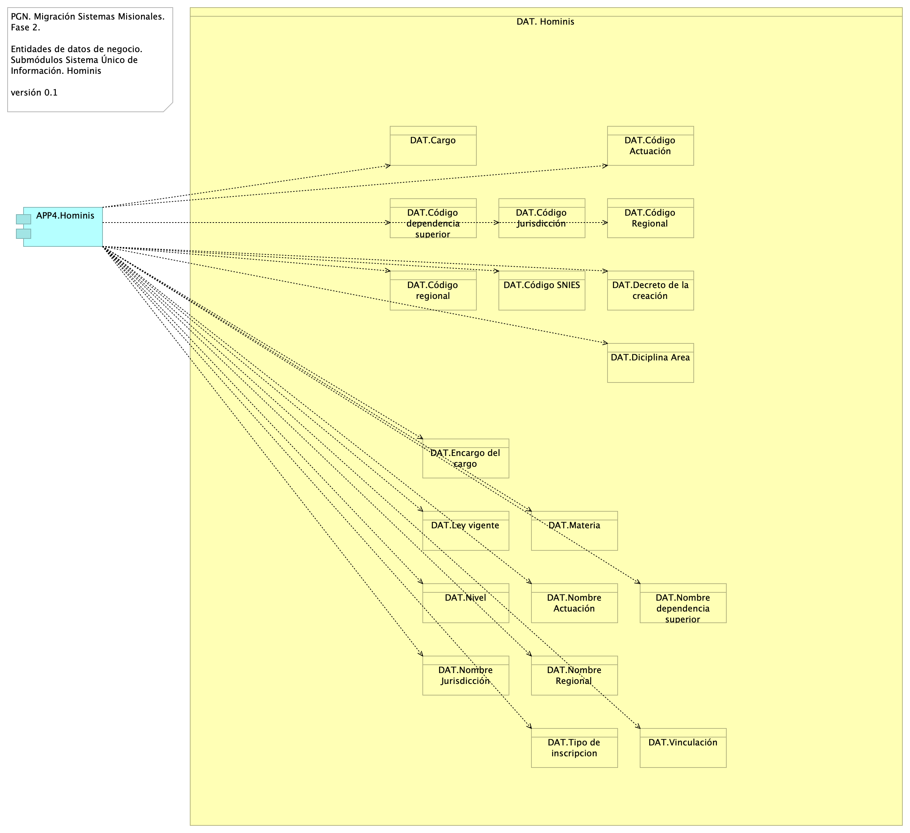
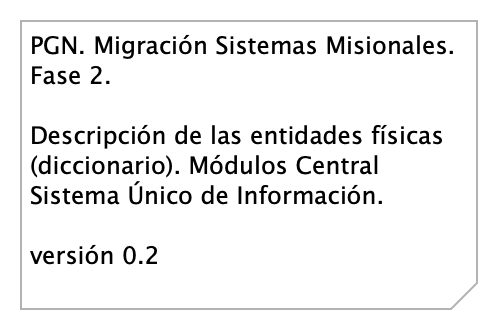

---
keywords:
- SOA
- madurez
- gobierno
- PGN
lang: en-US
date-meta: '2023-11-29'
author-meta:
- Harry Wong, ing.
header-includes: |
  <!--
  Manubot generated metadata rendered from header-includes-template.html.
  Suggest improvements at https://github.com/manubot/manubot/blob/main/manubot/process/header-includes-template.html
  -->
  <meta name="dc.format" content="text/html" />
  <meta property="og:type" content="article" />
  <meta name="dc.date" content="2023-11-29" />
  <meta name="citation_publication_date" content="2023-11-29" />
  <meta property="article:published_time" content="2023-11-29" />
  <meta name="dc.modified" content="2023-11-29T19:08:47+00:00" />
  <meta property="article:modified_time" content="2023-11-29T19:08:47+00:00" />
  <meta name="dc.language" content="en-US" />
  <meta name="citation_language" content="en-US" />
  <meta name="dc.relation.ispartof" content="Manubot" />
  <meta name="dc.publisher" content="Manubot" />
  <meta name="citation_journal_title" content="Manubot" />
  <meta name="citation_technical_report_institution" content="Manubot" />
  <meta name="citation_author" content="Harry Wong, ing." />
  <meta name="citation_author_institution" content="Arquitecto, Softgic" />
  <link rel="canonical" href="https://hwong23.github.io/pgn-078-datos/" />
  <meta property="og:url" content="https://hwong23.github.io/pgn-078-datos/" />
  <meta property="twitter:url" content="https://hwong23.github.io/pgn-078-datos/" />
  <meta name="citation_fulltext_html_url" content="https://hwong23.github.io/pgn-078-datos/" />
  <meta name="citation_pdf_url" content="https://hwong23.github.io/pgn-078-datos/manuscript.pdf" />
  <link rel="alternate" type="application/pdf" href="https://hwong23.github.io/pgn-078-datos/manuscript.pdf" />
  <link rel="alternate" type="text/html" href="https://hwong23.github.io/pgn-078-datos/v/af72748f13196789a47a9838122e753fc4f8bf2b/" />
  <meta name="manubot_html_url_versioned" content="https://hwong23.github.io/pgn-078-datos/v/af72748f13196789a47a9838122e753fc4f8bf2b/" />
  <meta name="manubot_pdf_url_versioned" content="https://hwong23.github.io/pgn-078-datos/v/af72748f13196789a47a9838122e753fc4f8bf2b/manuscript.pdf" />
  <meta property="og:type" content="article" />
  <meta property="twitter:card" content="summary_large_image" />
  <link rel="icon" type="image/png" sizes="192x192" href="https://manubot.org/favicon-192x192.png" />
  <link rel="mask-icon" href="https://manubot.org/safari-pinned-tab.svg" color="#ad1457" />
  <meta name="theme-color" content="#ad1457" />
  <!-- end Manubot generated metadata -->
bibliography:
- content/manual-references.bib
- content/manual-references.json
manubot-output-bibliography: output/references.json
manubot-output-citekeys: output/citations.tsv
manubot-requests-cache-path: ci/cache/requests-cache
manubot-clear-requests-cache: false
...

---
title: Documento de Arquitectura Migración Funcional PGN SUI
subtitle: OP 078-2023 - Fase 2, PGN Migración Funcional SUI
geometry:
  - top=1in
  - bottom=1in
fignos-cleveref: True
fignos-plus-name: Fig.
fignos-caption-name: Imagen
tablenos-caption-name: Tabla
...

 

 

 

 

 

 

| **Versión** del producto 1.af72748 de 29 Nov 2023

| **Presentado a**

| Procuraduría General de la Nación (PGN)

|

| **Fecha**

| 29 Nov 2023

\newpage

<small><em>Los productos de esta etapa, Migración Funcional SUI, Contrato 078-2023, 
([Web](https://hwong23.github.io/pgn-078-datos/v/af72748f13196789a47a9838122e753fc4f8bf2b/))
están basados en el resultado de la Fase 1 del proyecto PGN SUI del 2022,
[Sharepoint Softgic@af72748](http://softgic.sharepoint.com)
del November 29, 2023.
</em></small>

 

## Autores

+ **Harry Wong, ing.**
   
    · {.inline_icon width=16 height=16}
    [e_hwong](https://github.com/e_hwong)
     
  <small>
     Arquitecto, Softgic
  </small>

::: {#correspondence}
✉ — Enviar mensajes a Harry Wong, ing. \<harry.wong@softgic.co\>.

:::

 

## Objetivo del Documento
Descripción de los productos del trabajo de arquitectura de la Fase 2, proyecto Migración Funcional SUI de la Procuraduría General de la Nación (PGN en adelante), Contrato 078-2023. El principal propósito de este documento es informar de las decisiones sobre la disposición lógica y física de las partes del sistema. Por tanto, el documento contiene información estratégica, no un diseño detallado. Puntualmente, refleja decisiones sobre la plataforma tecnológica seleccionada, así como consideraciones importantes para el diseño y desarrollo, con procura de garantizar una solución técnicamente viable y óptima para el proyecto.

 

##  Control de Cambios {.page_break_before}
| Tema           | OP 078-2023 Fase 2, PGN Migración Funcional SUI      |
|----------------|----------------------------|
| Palabras clave | SUI, Softgic, PGN, Análisis de brecha, GAP, Comparativa              |
| Autor          |                            |
| Fuente         |                            |
| **Versión**    |                            |
| 1.af72748 | 2023-11-29. doc SUI* |
| 1.a95d7c9 | 2023-11-28. doc--nov |
| 1.ce7fa4e | 2023-11-28. doc--nov |
| 1.61ab07e | 2023-11-28. doc--nov |
| 1.2774000 | 2023-11-23. arqdoc1 |
| 1.3996a6d | 2023-11-23. arqdoc1 |
| 1.bd9674d | 2023-11-23. ppt1 |
| 1.091b916 | 2023-11-21. SIM |
| 1.a556cf5 | 2023-11-21. upd |
| 1.96d8fb8 | 2023-11-21. upd |
| Vínculos       | [N003a Vista Segmento PGN SUI](N03a%a20Vsta%20aSegenta%20SOA%20PGN.md) |

 

 

\newpage

## Contenidos
\toc

 

\newpage

# Introducción

## Propósito
Este documento tiene como propósito presentar la arquitectura del aplicativo Sistema Único de Información (SUI) para Procuraduría General de la Nación (PGN). según los requerimientos definidos durante la etapa de preventa y luego detallados en las historias de usuario.

La arquitectura será una guía para que el diseño y la implementación de los componentes que conforman la solución sean cobijados bajo lineamientos y premisas bien definidos, permitiendo a los elementos del sistema interactuar entre sí de forma coherente. La arquitectura será tomada como un diseño estratégico que establece restricciones globales para el diseño, define un marco inicial de trabajo para la implementación de los requerimientos funcionales y no funcionales.

La definición arquitectónica de este proyecto será un proceso evolutivo como tal. Este documento puede ser susceptible a cambios a medida que se vayan agregando nuevas funcionalidades o requisitos al sistema.

Uno de los principales propósitos de este documento es hacer una representación de las decisiones de disposición lógica y física de las partes del sistema; por tanto, es un diseño estratégico, no un diseño detallado. Puntualmente, refleja decisiones sobre la plataforma tecnológica seleccionada, así como consideraciones importantes para el diseño y desarrollo, con procura de garantizar una solución técnicamente viable y óptima para el proyecto.

 

 

\newpage

# Restricciones Principales
Informamos de las restricciones que hacen parte del proyecto, y por tanto, a considera en el ejercicio de arquitectura del presente proyecto.

Lista de restricciones de la migración SUI, 2023.

1. Restricciones de hardware o software en servidores. Los equipos de infraestructura del proyecto actual a tener en cuenta en los diseños de la solución de esta Fase 2 serán los mismos de la anterior Fase 1. Esto es, los que están descritos en el anexo técnico del contrato del proyecto.
1. Disponibilidad de recursos. Los recursos de implementación y validación de calidad de esta Fase del proyecto son los mismos a tener en cuenta en los diseños de la solución de esta Fase 2. Otros recursos a considerar son los descritos en el anexo técnico del contrato del proyecto.
1. Estándares. Los estándares seleccionados por la solución de este proyecto, (Fase 2, PGN Migración Funcional SUI, están determinados por el uso de las plataformas específicas determinadas por la implementación (desarrollo del software).
1. Requerimientos de interoperabilidad. Los recursos de interoperabilidad y colaboración entre sistemas, módulos, submódulos y aplicaciones de terceros relacionados con esta Fase del proyecto son los mismos a tener en cuenta en los diseños de la solución de esta Fase 2. Otros recursos a considerar son los descritos en el anexo técnico del contrato del proyecto.
1. Requerimientos de protocolos o interfaces. Los recursos de red, y protocolos de comunicación o transporte de esta Fase del proyecto a tener en cuenta en los diseños de la solución de esta Fase 2 parten de la base de los considerados en la anterior Fase 1. Otros recursos a considerar son los descritos en el anexo técnico del contrato del proyecto.
1. Seguridad. Las restricciones de seguridad del proyecto actual a tener en cuenta en los diseños de la solución de esta Fase 2 parten de la base de las de la anterior Fase 1. Esto es, los que están descritos en el anexo técnico del contrato del proyecto.

 

## Restricciones Secundarias
Otras restricciones a detallar.

1. Repositorio de datos.
1. Memoria, disco, CPU.
1. Requerimientos de rendimiento.

 

# Requisitos de Arquitectura (no funcional)
Entendemos como requisitos de arquitectura aquellos requerimientos no visibles pero estructurales, medibles, y que impactan al funcionamiento, desarrollo y mantenimiento de la solución migración SUI, objeto de este proyecto, OP 078-2023.
 
Definiremos estos requisitos de la solución a tener en cuenta al momento del desarrollo.

## Requerimientos generales
1. **Parametrización**. Crear desarrollos parametrizables necesarios para permitir la administración de la información de uso general.
1. **Interoperabilidad**. Crear desarrollos de SUI interoperables con otros sistemas de información de la entidad según requerimientos de los procesos.
1. **Diseño**. Los desarrollos complementarios deben responder a los criterios de bajo acoplamiento y alta cohesión.
1. **Reglas de negocio**. Las soluciones deben disponer de todas las validaciones y controles que garanticen la calidad, seguridad y unicidad de la información.
1. Para los casos que aplique, la solución debe contar con una integración con el servicio de correo de la Entidad.
1. Todos los desarrollos complementarios serán en su totalidad propiedad de la entidad, para lo cual la entidad podrá modificar y/o actualizar a futuro los procesos modelados, acorde a las necesidades; por tanto, deberán entregarse los derechos intelectuales y patrimoniales como parte de la documentación y el código fuente que corresponda.

\newpage

## Requisitos de Arquitectura (no funcional) Particulares

### Extensibilidad SUI
| Requisito      | Extensibilidad SUI |
|----------------|--------------------|
| Descripción | Concentración de los componentes de negocio, misionales, del SUI protegidos de cambios provenientes de otros sistemas. Ver Patrón de Diseño Migración SUI, más adelante en el documento. |
| Calidad sistémica | La extensibilidad que optimiza el diseño Migración SUI está dada por el intercambio de submódulos no misionales, como el gestor documental, sin afectación de los componentes misionales que este diseño protege. |

Table: Requisito no. 1, Migración SUI, Flexibilidad. {#tbl:requisito1-id}

### Mantenibilidad SUI

| Requisito      | Mantenibilidad SUI |
|----------------|--------------------|
| Descripción | Evitar las dependencia transitivas de los módulos misionales del SUI a componentes y sistemas de terceros o submódulos no misionales.  |
| Calidad sistémica | La mantenibilidad por control de dependencias que optimiza el diseño Migración SUI está dada por el control de cambios no programados sobre los componentes misionales del SUI (corrupción de componentes). Ver Patrón de Diseño Migración SUI, más adelante en el documento. |

Table: Requisito no. 2. {#tbl:requisito2-id}

# Arquitectura de Información (Datos)
* [Diagrama Modelo de Datos Conceptual](#diagrama-modelo-de-datos-conceptual)
	* [Migracion.2a.a1.Datos Información](#migracion.2a.a1.datos-información)
* [Diagrama Modelo de Datos Físico (diagramas entidad-relación)](#diagrama-modelo-de-datos-físico-diagramas-entidad-relación)
	* [Migracion.2a.a3. Datos Modelo Físico ](#migracion.2a.a3.-datos-modelo-físico-)
* [Diagrama Modelo de Datos Lógico](#diagrama-modelo-de-datos-lógico)
	* [Migracion.2c1. Datos SIM](#migracion.2c1.-datos-sim)
	* [Migracion.2c. Datos Hominis](#migracion.2c.-datos-hominis)
	* [Migracion.2c3. Datos Control Interno](#migracion.2c3.-datos-control-interno)
	* [Migracion.2c2. Datos SIRI](#migracion.2c2.-datos-siri)
* [Documento Diccionarios de Datos](#documento-diccionarios-de-datos)
	* [Migracion.2a.a2. Datos Diccionario](#migracion.2a.a2.-datos-diccionario)
* [Mapa de Información (flujos de información)](#mapa-de-información-flujos-de-información)
	* [Migracion.2d2. Datos Organización](#migracion.2d2.-datos-organización)
	* [Migracion.2d3. Datos Transporte (flujo SUI - SIM)](#migracion.2d3.-datos-transporte-flujo-sui---sim)
	* [Migracion.2d4. Datos Transporte (flujo SUI - SUI)](#migracion.2d4.-datos-transporte-flujo-sui---sui)
* [Modelo Ontológico](#modelo-ontológico)
	* [Migracion.2a.a34 Datos Ontológico](#migracion.2a.a34-datos-ontológico)

\newpage

# Diagrama Modelo de Datos Conceptual
## Migracion.2a.a1.Datos Información
{#fig:Migracion.2a.a1.DatosInformación width=5.32in}

Modelo de información. Organización y jerarquía de los grupos de datos (dominios) del SUI Migrado, 2023. 

### Dominios Principales de Información SUI Migrado

* Dominio común: SIM
* Dominios individuales
	* Hominis: Planta de personal, Hojas de vida, Seguimiento de desempeño, Carrera administrativa
	* Conjunto de datos Relatoría
	* Control Interno
	* Conciliación Administrativa

 

### Catálogo de Elementos
| Nombre| Tipo| Descripción| Prop.
|:--------|:--------|:--------|:--------|
|**DAT. Conciliación Administrativa**|business-object|Entidades de datos de negocio de capital humano de la PGN. Sistema de información Homini. ||
|**DAT. Control Interno**|business-object|||
|**DAT. Estratego**|business-object|Entidades de datos de negocio de capital humano de la PGN. Sistema de información Homini. ||
|**DAT. Hominis**|business-object|Entidades de datos de negocio de capital humano de la PGN. Sistema de información Homini. ||
|**DAT. Hominis. Carrera Administrativa**|business-object|Entidades de datos de negocio de capital humano de la PGN. Sistema de información Homini. ||
|**DAT. Hominis. Hojas Vida**|business-object|Entidades de datos de negocio de capital humano de la PGN. Sistema de información Homini. ||
|**DAT. Hominis. Planta Personal**|business-object|Entidades de datos de negocio de capital humano de la PGN. Sistema de información Homini. ||
|**DAT. Hominis. Seguimiento Desempeño**|business-object|Entidades de datos de negocio de capital humano de la PGN. Sistema de información Homini. ||
|**DAT. Relatoría**|business-object|Entidades de datos de negocio de capital humano de la PGN. Sistema de información Homini. ||
|**DAT. SIAF**|business-object|Entidades de datos de negocio de capital humano de la PGN. Sistema de información Homini. ||
|**DAT. SIM: lappiz**|business-object|||
|**DAT. SIRI**|business-object|||

 

\newpage

# Diagrama Modelo de Datos Físico (diagramas entidad-relación)
## Migracion.2a.a3. Datos Modelo Físico 
{#fig:Migracion.2a.a3.DatosModeloFísico width=}

Los modelos físicos representados en diagramas entidad - relación (ER) de los módulos SUI Migrado, como Hominis, Control Interno, Relatoría, SIRI, serán entregados como documentos aparte, anexos al documento actual en formato reproducible.

El formato reproducible en el que entregamos el modelo físico mediante la herramienta libre Draw.io.

{#fig:Migracion.2a.a3.DatosModeloFísico width=}

### Catálogo de Elementos
| Nombre| Tipo| Descripción| Prop.
|:--------|:--------|:--------|:--------|

 

\newpage

# Diagrama Modelo de Datos Lógico
## Migracion.2c1. Datos SIM
{#fig:Migracion.2c1.DatosSIM width=}

Identificación de entidades de datos de negocio relacionadas al módulo de SUI, SIM.

Estas entidades de datos de negocio son los que llamamos los tipos de datos internos del SUI y deben ser consideradas para la creación de las API de manejo del ciclo de vida de los datos de este módulo. 

### Catálogo de Elementos
| Nombre| Tipo| Descripción| Prop.
|:--------|:--------|:--------|:--------|
|**APP5.SIM**|application-component|Módulo central SUI migrado. Módulo independiente y asignado a un dominio particular de la PGN: SIM. ||
|**DAT. SIM: lappiz**|business-object|||
|**DAT01.Actividad**|business-object|Actividad del SIM||
|**DAT01.Actuación**|business-object|Actuación del SIM||
|**DAT01.Agencia**|business-object|Agencia del SIM||
|**DAT01.Atención Público**|business-object|||
|**DAT01.Cargo**|business-object|Cargo del SIM||
|**DAT01.Casos**|business-object|Casos del SIM||
|**DAT01.Causa - Relación**|business-object|||
|**DAT01.Causales**|business-object|Causales del SIM||
|**DAT01.Citación**|business-object|Citación del SIM||
|**DAT01.Clasificación**|business-object|Clasificación del SIM||
|**DAT01.Conciliación**|business-object|Conciliación del SIM||
|**DAT01.Corregimiento**|business-object|||
|**DAT01.Demanda**|business-object|Demanda del SIM||
|**DAT01.Departamento**|business-object|Departamentos del SIM.||
|**DAT01.Dependencia**|business-object|Dependencia del SIM||
|**DAT01.Derecho**|business-object|Derecho del SIM||
|**DAT01.Detalle Actividad**|business-object|||
|**DAT01.Detalle Entidad**|business-object|||
|**DAT01.Documento**|business-object|Documento del SIM||
|**DAT01.Entidad**|business-object|Entidad del SIM||
|**DAT01.Formatos**|business-object|Formatos del SIM||
|**DAT01.Funcionario**|business-object|Funcionario del SIM||
|**DAT01.Grupo de Interés**|business-object|||
|**DAT01.Instrumento**|business-object|Instrumento del SIM||
|**DAT01.Interviniente**|business-object|Interviniente del SIM||
|**DAT01.Municipio**|business-object|Municipio del SIM||
|**DAT01.Objetivo Estratégico**|business-object|||
|**DAT01.Observación**|business-object|Observación del SIM||
|**DAT01.Ocupación**|business-object|Ocupación del SIM||
|**DAT01.País**|business-object|País del SIM||
|**DAT01.Persona**|business-object|Personas del SIM.||
|**DAT01.Plan Ejecución**|business-object|Plan Ejecución del SIM||
|**DAT01.Población**|business-object|Población del SIM||
|**DAT01.Prevención**|business-object|Prevención del SIM||
|**DAT01.Proceso**|business-object|Proceso del SIM||
|**DAT01.Protocolo**|business-object|Protocolo del SIM||
|**DAT01.Radicación**|business-object|Radicación del SIM||
|**DAT01.Recusación**|business-object|Recusación del SIM||
|**DAT01.Relación Casos**|business-object|Relación casos del SIM||
|**DAT01.Sector**|business-object|Sector del SIM||
|**DAT01.Ubicación**|business-object|Ubicación del SIM||

 

## Migracion.2c. Datos Hominis
{#fig:Migracion.2c.DatosHominis width=5.32in}

Identificación de entidades de datos de negocio relacionadas al módulo de gestión de capital del SUI, Hominis.

Estas entidades de datos de negocio son los que llamamos los tipos de datos internos del SUI y deben ser consideradas para la creación de las API de manejo del ciclo de vida de los datos de este módulo.

### Catálogo de Elementos
| Nombre| Tipo| Descripción| Prop.
|:--------|:--------|:--------|:--------|
|**APP4.Hominis**|application-component|Módulo del SUI. Gestión de capital humano, funcionarios y cargos de representación y libre remoción de la PGN. ||
|**DAT. Hominis**|business-object|Entidades de datos de negocio de capital humano de la PGN. Sistema de información Homini. ||
|**DAT.Cargo**|business-object|||
|**DAT.Código Actuación**|business-object|||
|**DAT.Código Jurisdicción**|business-object|||
|**DAT.Código Regional**|business-object|||
|**DAT.Código SNIES**|business-object|||
|**DAT.Código dependencia superior**|business-object|||
|**DAT.Código regional**|business-object|||
|**DAT.Decreto de la creación**|business-object|||
|**DAT.Diciplina Area**|business-object|||
|**DAT.Encargo del cargo**|business-object|||
|**DAT.Ley vigente**|business-object|||
|**DAT.Materia**|business-object|||
|**DAT.Nivel**|business-object|||
|**DAT.Nombre Actuación**|business-object|||
|**DAT.Nombre Jurisdicción**|business-object|||
|**DAT.Nombre Regional**|business-object|||
|**DAT.Nombre dependencia superior**|business-object|||
|**DAT.Tipo de inscripcion**|business-object|||
|**DAT.Vinculación**|business-object|||

 

## Migracion.2c3. Datos Control Interno
{#fig:Migracion.2c3.DatosControlInterno width=}

Identificación de entidades de datos de negocio relacionadas al módulo de seguimiento del desempeño de la PGN del SUI, Control Interno.

Estas entidades de datos de negocio son los que llamamos los tipos de datos internos del SUI y deben ser consideradas para la creación de las API de manejo del ciclo de vida de los datos de este módulo. 

### Catálogo de Elementos
| Nombre| Tipo| Descripción| Prop.
|:--------|:--------|:--------|:--------|
|**APP3.Control interno**|application-component|Módulo central SUI migrado. Módulo independiente y asignado a un dominio particular de la PGN: Control Interno. ||
|**DAT.Dependencia**|business-object|||
|**DAT.Funcionario**|business-object|||
|**DAT.Proceso**|business-object|||
|**DAT.Tipo de proceso**|business-object|||

 

## Migracion.2c2. Datos SIRI
{#fig:Migracion.2c2.DatosSIRI width=}

Identificación de entidades de datos de negocio relacionadas al módulo del SUI, SIRI.

Estas entidades de datos de negocio son los que llamamos los tipos de datos internos del SUI y deben ser consideradas para la creación de las API de manejo del ciclo de vida de los datos de este módulo. 

### Catálogo de Elementos
| Nombre| Tipo| Descripción| Prop.
|:--------|:--------|:--------|:--------|
|**APP2.SIRI**|application-component|Módulo central SUI migrado. Módulo independiente y asignado a un dominio particular de la PGN: SIRI. ||
|**DAT.Entidad**|business-object|||

 

\newpage

# Documento Diccionarios de Datos
## Migracion.2a.a2. Datos Diccionario
{#fig:Migracion.2a.a2.DatosDiccionario width=5.32in}

Los diccionarios de datos explicativos de los modelos de datos físicos de los módulos del SUI Migrado, representados en tablas campo-descripción, serán entregados como documentos anexos aparte del documento de arquitectura de datos actual, y en formato reproducible.

El formato reproducible en el que entregamos los diccionarios de datos del modelo físico es DOCX.

{#fig:Migracion.2a.a3.DatosModeloFísico width=}

### Catálogo de Elementos
| Nombre| Tipo| Descripción| Prop.
|:--------|:--------|:--------|:--------|

 

\newpage

# Mapa de Información (flujos de información)
## Migracion.2d2. Datos Organización
{#fig:Migracion.2d2.DatosOrganización width=5.32in}

Modelo de acceso y procesamiento a datos de negocio del SUI. La imagen siguiente presenta la organización de los ítems de transporte de datos de negocio necesarios para que los módulos del SUI puedan recolectar, procesar, integrar y almacenarlo de forma organizada y escalable.

Mediante esta organización, los datos de negocio son transportados desde sus respectivas fuentes mediante interfaces (principio de extensión y mantenibilidad referidos en las restricciones de la arquitecura del SUI Migrado). Los datos externos, entendidos como los de otros proveedores, son obtenidos mediante un intermediario: una API externa (_reverse proxy_).

Consideramos tres tipos datos: datos transaccionales, históricos y externos, y presentamos una manera distinta de tratarlos y transportarlos.

### Catálogo de Elementos
| Nombre| Tipo| Descripción| Prop.
|:--------|:--------|:--------|:--------|
|**cc:PGN SUI (módulo central)**|application-collaboration|Módulo central SUI migrado. Módulo independiente y asignado a un dominio particular de la PGN. ||
|**cc:PGN SUI (módulo central) 2**|application-collaboration|Módulo central SUI migrado. Módulo independiente y asignado a un dominio particular de la PGN. ||
|**APP1.Relatoría**|application-component|Módulo del SUI. Relatoría pública. Publicación de información de referencia para funcionarios y personas naturales, cientes de la PGN.  ||
|**APP2.SIRI**|application-component|Módulo central SUI migrado. Módulo independiente y asignado a un dominio particular de la PGN: SIRI. ||
|**APP3.Control interno**|application-component|Módulo central SUI migrado. Módulo independiente y asignado a un dominio particular de la PGN: Control Interno. ||
|**APP4.Hominis**|application-component|Módulo del SUI. Gestión de capital humano, funcionarios y cargos de representación y libre remoción de la PGN. ||
|**APP6.Estratego**|application-component|Módulo central SUI migrado. Módulo independiente y asignado a un dominio particular de la PGN: Estratego. ||
|**Interacción SUI - SIM**|application-interaction|Interacción de API SUI con API SIM para el transporte de entidades de negocio. Los tipos de datos que utilizan esta interacción entre aplicaciones son los datos externos al módulo central SUI que los requiera, los datos históricos que están por fuera del móduo SUI migrado, y los datos transaccionales de otros módulos SUI migrados. ||
|**Interfaz de Acceso Proveedores**|application-interface|Interfaz de acceso a los tipos de datos externos al SUI. El patrón de API Externa (reverse proxie) tiene el rol de unir y referir a los datos externos e históricos al SUI Migrado de tal manera que hace transparente la localización y el formato de este tipo de datos. ||
|**Interfaz de Almacenaniento**|application-interface|Interfaz de acceso a los repositorio, base de datos relacionales y no jerárquicas. Tipos de datos transaccionales, internos, del SUI. ||
|**Procesamiento de lotes PGN**|application-process|Los procesos de lotes, que requieren volumenes de datos altos, deben hacer parte de la arquitectura de datos del SUI. ||
|**API Externa (flujo de datos)**|application-service|El patrón de API Externa (reverse proxie) tiene el rol de unir y referir a los datos externos e históricos al SUI Migrado de tal manera que hace transparente la localización y el formato de este tipo de datos. ||
|**Datos externos**|data-object|||
|**Datos históricos**|data-object|||
|**Datos transaccionales SUI**|data-object|||
|**Datos transaccionales módulo SUI**|data-object|Registros de trabajo de un módulo SUI Migrado, 2023. ||

 

## Migracion.2d3. Datos Transporte (flujo SUI - SIM)
.png){#fig:Migracion.2d3.DatosTransporte(flujoSUI-SIM) width=5.32in}

Modelo de acceso a datos de negocio del SIM. 

La imagen siguiente presenta la organización de los ítems de transporte de datos de negocio necesarios para que los módulos del SUI puedan recolectar, procesar, integrar y almacenarlo de forma organizada y escalable.

Mediante esta organización, los datos de negocio son transportados desde sus respectivas fuentes mediante interfaces (principio de extensión y mantenibilidad referidos en las restricciones de la arquitecura del SUI Migrado). Los datos externos, entendidos como los de otros proveedores, son obtenidos mediante un intermediario: una API externa (_reverse proxy_).

Consideramos tres tipos datos: datos transaccionales, históricos y externos, y presentamos una manera distinta de tratarlos y transportarlos.

### Catálogo de Elementos
| Nombre| Tipo| Descripción| Prop.
|:--------|:--------|:--------|:--------|
|**cc:PGN SUI (módulo central)**|application-collaboration|Módulo central SUI migrado. Módulo independiente y asignado a un dominio particular de la PGN. ||
|**APP5.SIM**|application-component|Módulo central SUI migrado. Módulo independiente y asignado a un dominio particular de la PGN: SIM. ||
|**Interacción SUI - SIM**|application-interaction|Interacción de API SUI con API SIM para el transporte de entidades de negocio. Los tipos de datos que utilizan esta interacción entre aplicaciones son los datos externos al módulo central SUI que los requiera, los datos históricos que están por fuera del móduo SUI migrado, y los datos transaccionales de otros módulos SUI migrados. ||
|**Interfaz de Acceso Proveedores**|application-interface|Interfaz de acceso a los tipos de datos externos al SUI. El patrón de API Externa (reverse proxie) tiene el rol de unir y referir a los datos externos e históricos al SUI Migrado de tal manera que hace transparente la localización y el formato de este tipo de datos. ||
|**Interfaz de Almacenaniento**|application-interface|Interfaz de acceso a los repositorio, base de datos relacionales y no jerárquicas. Tipos de datos transaccionales, internos, del SUI. ||
|**Datos externos**|data-object|||
|**Datos históricos**|data-object|||
|**Datos transaccionales módulo SUI**|data-object|Registros de trabajo de un módulo SUI Migrado, 2023. ||

 

## Migracion.2d4. Datos Transporte (flujo SUI - SUI)
.png){#fig:Migracion.2d4.DatosTransporte(flujoSUI-SUI) width=5.32in}

Modelo de acceso y procesamiento a datos de negocio del SUI. La imagen siguiente presenta la organización de los ítems de transporte de datos de negocio necesarios para que los módulos del SUI puedan recolectar, procesar, integrar y almacenarlo de forma organizada y escalable.

Mediante esta organización, los datos de negocio son transportados desde sus respectivas fuentes mediante interfaces (principio de extensión y mantenibilidad referidos en las restricciones de la arquitecura del SUI Migrado). Los datos externos, entendidos como los de otros proveedores, son obtenidos mediante un intermediario: una API externa (_reverse proxy_).

Consideramos tres tipos datos: datos transaccionales, históricos y externos, y presentamos una manera distinta de tratarlos y transportarlos.

### Catálogo de Elementos
| Nombre| Tipo| Descripción| Prop.
|:--------|:--------|:--------|:--------|
|**cc:PGN SUI (módulo central)**|application-collaboration|Módulo central SUI migrado. Módulo independiente y asignado a un dominio particular de la PGN. ||
|**cc:PGN SUI (módulo central) 2**|application-collaboration|Módulo central SUI migrado. Módulo independiente y asignado a un dominio particular de la PGN. ||
|**Interfaz de Acceso Proveedores**|application-interface|Interfaz de acceso a los tipos de datos externos al SUI. El patrón de API Externa (reverse proxie) tiene el rol de unir y referir a los datos externos e históricos al SUI Migrado de tal manera que hace transparente la localización y el formato de este tipo de datos. ||
|**Interfaz de Acceso Proveedores 2**|application-interface|Interfaz de acceso a los tipos de datos externos al SUI. El patrón de API Externa (reverse proxie) tiene el rol de unir y referir a los datos externos e históricos al SUI Migrado de tal manera que hace transparente la localización y el formato de este tipo de datos. ||
|**Interfaz de Almacenaniento**|application-interface|Interfaz de acceso a los repositorio, base de datos relacionales y no jerárquicas. Tipos de datos transaccionales, internos, del SUI. ||
|**Datos transaccionales SUI**|data-object|||
|**Datos transaccionales módulo SUI**|data-object|Registros de trabajo de un módulo SUI Migrado, 2023. ||

 

\newpage

# Modelo Ontológico
## Migracion.2a.a34 Datos Ontológico
{#fig:Migracion.2a.a34DatosOntológico width=5.32in}

En construcción.

### Catálogo de Elementos
| Nombre| Tipo| Descripción| Prop.
|:--------|:--------|:--------|:--------|

 

<<<<<<< HEAD
``Generated on: Tue Nov 28 2023 09:30:23 GMT-0500 (COT)``
=======
``Generated on: Thu Nov 23 2023 14:06:13 GMT-0500 (COT)``
>>>>>>> 2774000b8fa9cd49bf550fa803816519df3d810b

## Requerimientos de Administración
1.	Las soluciones deben permitir la administración de los Roles de Usuarios: esta funcionalidad debe permitir configurar los diferentes roles de los usuarios funcionales de los procesos. 
2.	Administrar los Perfiles de acceso por rol: Esta funcionalidad permitirá configurar a que funcionalidades u opciones de la solución puede entrar un usuario con un rol específico. 
Administrar los Usuarios de la Solución: Esta funcionalidad debe permitir configurar, activar, desactivar usuarios de las soluciones desarrolladas.
4.	Para los casos que aplique se debe asociar el desarrollo con el mecanismo de Firmas (digital, electrónica o mecánica): Esta funcionalidad debe permitir configurar los usuarios que tienen permitida la aprobación de documentos desde la solución implementada, a través del tipo de firma que corresponda. 
5.	Administrar los Permisos de acceso: Esta funcionalidad permite definir específicamente a que servicios de la solución puede ingresar un usuario (CRUD). 
6.	En los desarrollos se debe contar con un módulo de auditoría que permita generar consultas para conocer quién y cuándo se ha realizado una actuación determinada dentro de procesos críticos, almacenando el código del usuario la actuación, la acción, la fecha, la hora, y la dirección IP de la máquina. 
7.	Las soluciones deben permitir la configuración de permisos de consulta con diferentes alcances para cada tipo de usuario. 
8.	Desde la interfaz de usuario se debe poder crear, modificar o inactivar usuarios, perfiles o roles, permisos a las diferentes funcionalidades de la solución. 
9.	Las soluciones deben permitir la definición de varios tipos de usuario. 
10.	Las soluciones deben permitir la parametrización de los consecutivos que maneja la entidad para los diferentes documentos generados por las soluciones. 
11.	Debe permitir parametrizar la vinculación del consecutivo a un documento en forma manual o automática. 
12.	Las soluciones deben permitir que se configure la autenticación de forma interna integrándose con LDAP el acceso de los usuarios y actores de las diferentes dependencias de la entidad que interactúen con los demás sistemas. 

 

## Requerimientos de Seguridad
1. Las soluciones deben dar cumplimiento a las políticas institucionales del sistema de gestión de seguridad de la información establecidas por la entidad que busca garantizar la confidencialidad, integridad y disponibilidad de la información que se genera, procesa, almacena y/o transmite en los sistemas de Información de la Entidad. 
1. Las soluciones de automatización de procesos a implementar deben permitir la Gestión de Seguridad de Usuarios, grupos de usuarios y asignación de Roles y perfiles de usuarios, permitiendo asociar las acciones disponibles en la solución con respecto a roles de usuario, permitiendo parametrizar las funcionalidades que cada actor puede usar en la solución. 
1. Un usuario puede estar asociado a uno o más roles, de tal manera que los menús de navegación de la solución se muestran o despliegan dependiendo de las acciones asociadas a cada rol de usuario, permitiendo así que cuando el usuario es autenticado correctamente, la solución verifica los roles que tiene activos para otorgarle únicamente las acciones autorizadas. 
1. El diseño de la solución debe definir los criterios necesarios para asegurar la trazabilidad y auditoría sobre las acciones de creación, actualización, modificación o borrado de los componentes de información, de tal manera que la solución debe permitirle al administrador de la solución parametrizar las tablas y eventos que pueden auditarse. 
1. Las soluciones deben tener en cuenta mecanismos que aseguren el registro histórico para poder mantener la trazabilidad de las acciones realizadas por los usuarios, contemplando el registro de auditoría que contiene información de fecha y hora, identificación del registro, tabla afectada, descripción del evento, tipo de evento, usuario que realiza la acción, identificación de sesión y dirección IP del usuario que efectuó la transacción. 
1. La solución debe proveer una consulta que permita a un usuario con los privilegios asignados, consultar los registros de auditoría, aplicando criterios de filtro (usuario, maquina, rango de fechas y tipo de operación). 
1. Las soluciones deben integrarse con LDAP – (Lightweight Directory Access Protocol) para los procesos de inicio de sesión y autenticación. La solución debe soportar la integración Nativa con Active Directory de Microsoft. Para usuarios externos el mecanismo de autorización, autenticación y acceso será controlado a través del modelo de seguridad de la solución (no habrá autenticación para usuarios externos). 
1. Las soluciones deben cumplir con los lineamientos de seguridad relacionados a su utilización a través de redes públicas y privadas, garantizando la confidencialidad e integridad de la información y acceso a ella. 
1. Debe evidenciar que, a través de pruebas de vulnerabilidad, garantiza la seguridad de la información. Estas pruebas deben suministrar evidencia de que se usaron umbrales de seguridad para establecer niveles mínimos aceptables de calidad de la seguridad y de la privacidad. 
1. Debe incluir un mecanismo de cifrado de los datos que se transportan entre los diferentes componentes tecnológicos y los datos sensibles de la base de datos que representen un alto nivel de confidencialidad. 
1. A nivel de la base de datos debe poder definirse reglas de validación de integridad de datos (unicidad, referencial y negocio). 
1. Debe contemplar el cumplimiento de la normatividad vigente en cuanto a protección de datos personales y debe permitir el manejo de excepciones. 
1. Para los casos que aplique se debe permitir el manejo de certificados y/o firmas digitales en los documentos que así se definan para efectos de aprobación y digitalización. 
1. Debe contemplar las prácticas de desarrollo seguro de aplicaciones y/o implementación segura de productos, para su naturaleza Web based. 
1. Debe funcionar sobre protocolo SSL (certificados internos de la entidad cuando los sistemas de información sean internas y certificados validos públicamente cuando los sistemas de información estén expuestas a internet). 
1. Debe entregar un procedimiento para el respaldo de la información de acuerdo con las necesidades de la entidad. 
1. Debe incluir uso de criptografía para transacciones y/o campos sensibles según lo indiquen las normas vigentes y las necesidades específicas del negocio de acuerdo como lo determine la entidad. 
1. Debe contemplar un modelo de datos que garantice base de datos única para evitar que se pueda presentar duplicidad de información. 
1. En la información confidencial solo puede ser consultada por los perfiles autorizados e igualmente restringir documentos de consulta según los privilegios o permisos asociados. 
1. A nivel de la base de datos debe poder definirse reglas de validación de integridad de datos (unicidad, referencial y negocio). 
1. Debe cerrar las transacciones luego de máximo 10 minutos de inactividad. 
1. Debe incluir controles de bloqueo de cuenta después de un máximo de 5 intentos erróneos a fin de evitar ataques de fuerza bruta. 
1. Debe evidenciar el resultado positivo frente apruebas de ethical hacking, análisis de vulnerabilidades, carga, estrés y desempeño antes de la puesta en operación de acuerdo con los lineamientos de la entidad. 
1. Debe cumplir con todos los lineamientos de desarrollo seguro establecidos en The OWASP Foundation recomendados en la “Guía de desarrollo OWASP” y “OWAS Cheat Sheet”. 

 

\newpage

# Referencias {.page_break_before}
<!-- Explicitly insert bibliography here -->

@eservices1-22 @eservices3-22 @eservices4-22 @eservices5-23 @eservices6-12 @eservices7-23 @bptrends07

